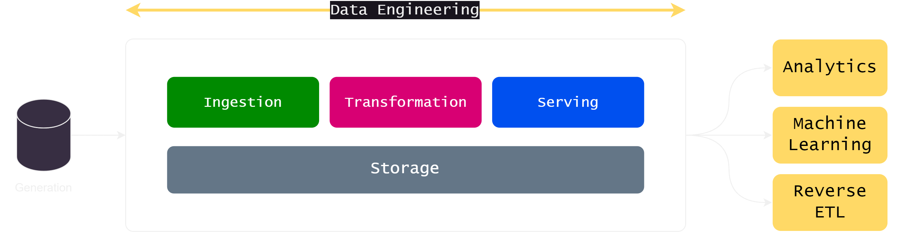

# Introduction to Data Engineering and Python:

Data engineering is a crucial discipline at the intersection of data science, software engineering, and data management. It involves the design, development, and maintenance of systems and architectures that enable the acquisition, storage, processing, and analysis of large volumes of data. Python, with its simplicity, versatility, and robust ecosystem of libraries, has become an indispensable tool for data engineers worldwide.

## Role of Python in Data Engineering:

Python plays a pivotal role in data engineering due to its ease of use, readability, and extensive libraries tailored for various data-related tasks. Here are some key roles Python fulfills in data engineering:

1. **Data Collection:** Python provides libraries such as Requests and BeautifulSoup for web scraping, APIs like Pandas for data ingestion, and connectors for databases like SQLAlchemy, enabling data engineers to efficiently collect data from diverse sources.

2. **Data Transformation:** Python's libraries like Pandas and NumPy offer powerful tools for data manipulation and transformation. Data engineers can reshape, clean, and preprocess data using these libraries, preparing it for downstream analysis.

3. **Workflow Orchestration:** Python frameworks such as Apache Airflow and Luigi facilitate the orchestration of complex data workflows. Data engineers can define, schedule, and monitor data pipelines with ease, ensuring data reliability and scalability.

4. **Big Data Processing:** Python interfaces with big data processing frameworks like Apache Spark and Hadoop through libraries like PySpark and Hadoop Streaming. Data engineers leverage Python's flexibility to perform distributed computing tasks on massive datasets.

In addition to its role in the data engineering lifecycle, Python offers several advantages that make it indispensable for data engineers:

- **Ease of Learning and Use:** Python's simple syntax and readability make it accessible to beginners and experienced programmers alike. Data engineers can quickly prototype solutions, iterate on ideas, and collaborate effectively using Python.
- **Rich Ecosystem of Libraries:** Python boasts a vast ecosystem of libraries tailored for data engineering tasks, including data manipulation, visualization, machine learning, and more. From Pandas and NumPy to scikit-learn and TensorFlow, Python offers a comprehensive toolkit for building data solutions.
- **Community Support and Resources:** Python benefits from a vibrant community of developers, data scientists, and data engineers who contribute to its ecosystem. With extensive documentation, tutorials, and online forums, Python provides ample resources for learning and troubleshooting.
- **Cross-Platform Compatibility:** Python runs on multiple platforms, including Windows, macOS, and Linux, making it suitable for developing data solutions across different environments. Data engineers can seamlessly deploy Python-based applications on various platforms without compatibility issues.

By harnessing the power of Python and mastering its libraries and frameworks, data engineers can build robust, scalable, and efficient data solutions that drive business value and innovation. Whether it's collecting, transforming, processing, or analyzing data, Python remains an indispensable tool in the data engineer's toolkit.

---

## Data Engineering Lifecycle:

The data engineering lifecycle encompasses various stages involved in designing, implementing, and maintaining data systems. Here are the key phases:

1. **Requirements Gathering:** Understanding stakeholders' requirements and data sources is essential for designing an effective data solution.

2. **Data Ingestion:** Acquiring data from internal and external sources, including databases, APIs, files, and streams, and loading it into the data ecosystem.

3. **Data Transformation:** Cleansing, transforming, and enriching raw data to make it suitable for analysis and consumption. This phase often involves batch processing, stream processing, or a combination of both.

4. **Data Serving and Storage:** Storing processed data in appropriate data storage solutions, such as relational databases, data warehouses, data lakes, or NoSQL databases, ensuring scalability, reliability, and performance.

5. Monitoring and Maintenance: Continuously monitoring data pipelines, performance metrics, and data quality to ensure system reliability, efficiency, and adherence to SLAs. Regular maintenance and optimization are essential to keep the data infrastructure robust and scalable.

---

**In addition to the data engineering lifecycle, data engineers should familiarize themselves with the following topics:**

- Data Modeling: Understanding different data modeling techniques, such as relational modeling, dimensional modeling, and schema design, to structure data effectively.

- Data Governance: Implementing policies, processes, and controls to ensure data quality, integrity, security, and compliance throughout the data lifecycle.

- Cloud Computing: Leveraging cloud platforms like AWS, Azure, and Google Cloud for scalable, cost-effective storage, processing, and analytics of big data.

- DevOps Practices: Adopting DevOps principles and practices, such as version control, continuous integration, and automated testing, to streamline data pipeline development and deployment.

- Scalability and Performance Optimization: Designing data systems for horizontal scalability, optimizing query performance, and tuning infrastructure for efficiency and cost-effectiveness.

By mastering these foundational concepts and skills, aspiring data engineers can embark on a rewarding journey in the field of data engineering, leveraging Python as their primary tool for building robust and scalable data solutions.

---
### Reading materials:
- **Book:** "Data Engineering with Python" by Paul Crickard III and Thomas H. Davenport (Chapter 1: What is Data Engineering?)
- **Book:** "Fundamentals of Data Engineering: Plan and Build Robust Data Systems " by Joe Reis, Matt Housley (Chapter 1: Data Engineering Described)
