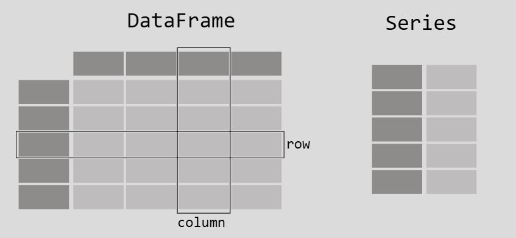

# Data Manipulation with Pandas

Data manipulation is an essential part of the data analysis process, involving the transformation and preparation of raw data into a format suitable for analysis. Pandas, a powerful data analysis library in Python, provides robust and flexible tools for data manipulation. This includes capabilities for filtering, sorting, grouping, merging, and cleaning data, among other tasks. This section dives into the various aspects of data manipulation with Pandas, highlighting the key functionalities and providing practical examples to illustrate their use.

## Introduction to Pandas

Pandas is an open-source data analysis and manipulation tool built on top of the Python programming language. It is designed for working with labeled data, providing easy-to-use data structures and data analysis tools. Imagine a robust toolbox specifically crafted for handling tabular data. That's Pandas in a nutshell. It empowers you to:

- **Effortlessly read and write data** from various sources like CSV, Excel, and databases.
- **Organize and structure your data** into efficient DataFrames (think of them as fancy spreadsheets).
- **Perform data cleaning and manipulation** tasks with ease, from filtering to sorting.
- **Calculate summary statistics** and gain insights from your data.
- **Create stunning data visualizations** (think bar charts, line graphs, and more).

## The Two Pillars of Pandas: Series and DataFrames

### 1- Series

- **One-dimensional array:** A Series is a fundamental data structure in Pandas that holds a collection of elements along a single axis. Think of it as a single column in a spreadsheet or a labeled array.
- **Labeled data:** Each element in a Series has a corresponding label, also called an index, which allows you to efficiently access and manipulate data.
- **Data types:** Series can hold data of various types, including integers, floats, strings, Python objects, and more.
- **Creation:** You can create a Series from various data sources like lists, NumPy arrays, dictionaries, or even another Series.

**Example:**

```python
import pandas as pd

# Create a Series from a list
data = [10, 20, 30, 40]
my_series = pd.Series(data)
print(my_series)

# Output:
# 0    10
# 1    20
# 2    30
# 3    40
# dtype: int64

# Create a Series from a dictionary (index becomes the label)
data = {"name": "Alice", "age": 30, "city": "New York"}
my_series = pd.Series(data)
print(my_series)

# Output:
# name      Alice
# age         30
# city  New York
# dtype: object
```

### 2- DataFrame

- **Two-dimensional labeled data:** A DataFrame is the workhorse of Pandas. It's a tabular data structure with rows and columns, similar to a spreadsheet or SQL table.
- **Labeled columns and rows:** DataFrames have labeled columns and an optional index (labels) for rows, enabling efficient data access and manipulation.
- **Heterogeneous data:** DataFrames can hold columns of different data types within the same structure, providing flexibility for storing diverse data.
- **Creation:** You can create a DataFrame from various sources like dictionaries of lists/arrays, lists of dictionaries, existing Series objects, or even another DataFrame.

**Example:**

```python
# Create a DataFrame from a dictionary of lists
data = {
    "name": ["Alice", "Bob", "Charlie"],
    "age":  [30, 25, 40],
    "city": ["New York", "London", "Paris"]
}
my_dataframe = pd.DataFrame(data)
print(my_dataframe)

# Output:
#         name  age       city
# 0      Alice   30     New York
# 1        Bob   25     London
# 2    Charlie   40     Paris

# Create a DataFrame from a list of dictionaries
data = [
    {"name": "Alice", "age": 30, "city": "New York"},
    {"name": "Bob", "age": 25, "city": "London"},
    {"name": "Charlie", "age": 40, "city": "Paris"},
]
my_dataframe = pd.DataFrame(data)
print(my_dataframe)

# Output: (same as the previous example)
```

**Each column in a `DataFrame` is a `Series`**



#### Key Differences and Use Cases:

- **Dimensionality:** Series (1D) vs. DataFrame (2D)
- **Data Type:** Series can hold a single data type per column, while DataFrames can have mixed data types across columns.
- **Use Cases:** Series are suitable for representing one-dimensional data (e.g., temperature readings, list of names), while DataFrames are ideal for storing tabular data with multiple dimensions and data types (e.g., customer information, financial data).

**In summary:**

- Series are building blocks for DataFrames.
- Series are efficient for specific data operations on a single dimension.
- DataFrames offer a powerful structure for organizing and manipulating complex, multi-dimensional datasets.

## Key Concepts in Data Manipulation

#### 1. Data Loading

Loading data into Pandas is typically done using functions like `read_csv`, `read_excel`, `read_sql`, etc. These functions can read data from various file formats and databases into DataFrames.

**Example: Loading a CSV File**

```python
import pandas as pd

df = pd.read_csv('data.csv')
print(df.head())
```

#### 2. Filtering Data

Filtering is used to subset data based on conditions. Pandas provides various ways to filter data using boolean indexing, `loc`, and `iloc`.

**Example: Filtering Rows Based on Conditions**

```python
# Filter rows where the 'Age' column is greater than 30
filtered_df = df[df['Age'] > 30]
print(filtered_df)
```

#### 3. Sorting Data

Sorting is used to arrange data in a specific order. You can sort data by one or multiple columns using the `sort_values` function.

**Example: Sorting DataFrame by Column Values**

```python
# Sort DataFrame by 'Age' in descending order
sorted_df = df.sort_values(by='Age', ascending=False)
print(sorted_df)
```

#### 4. Grouping Data

Grouping is used to aggregate data based on some criteria. The `groupby` function in Pandas allows you to split data into groups and apply functions to each group independently.

**Example: Grouping and Aggregating Data**

```python
# Group by 'Department' and calculate the mean 'Salary'
grouped_df = df.groupby('Department')['Salary'].mean()
print(grouped_df)
```

#### 5. Data Cleaning

Data cleaning involves handling missing values, duplicates, and erroneous data. Pandas provides functions like `dropna`, `fillna`, and `drop_duplicates` for data cleaning.

**Example: Handling Missing Data**

```python
# Fill missing values in 'Salary' column with the mean value
df['Salary'].fillna(df['Salary'].mean(), inplace=True)
print(df)
```

#### 6. Data Transformation

Data transformation includes operations like applying functions to columns, changing data types, and renaming columns. Pandas provides various functions for these transformations.

**Example: Applying Functions to Columns**

```python
# Apply a function to the 'Salary' column to convert values to thousands
df['Salary'] = df['Salary'].apply(lambda x: x / 1000)
print(df)
```

#### 7. Merging and Joining DataFrames

Merging and joining are used to combine data from multiple DataFrames. The `merge` and `join` functions facilitate these operations.

**Example: Merging Two DataFrames**

```python
# Merge two DataFrames on the 'EmployeeID' column
merged_df = pd.merge(df1, df2, on='EmployeeID')
print(merged_df)
```

### Practical Example of Data Manipulation with Pandas

Let's walk through a practical example of data manipulation using a sample dataset. Suppose we have a CSV file named `employees.csv` with the following columns: `EmployeeID`, `Name`, `Department`, `Age`, and `Salary`.

#### Step-by-Step Data Manipulation Example

1. **Load the Data**

```python
import pandas as pd

# Load the dataset
df = pd.read_csv('./datasets/employees.csv')
print("Original DataFrame:")
print(df)
```

2. **Filter the Data**

```python
# Filter employees older than 30 years
filtered_df = df[df['Age'] > 30]
print("\nFiltered DataFrame (Age > 30):")
print(filtered_df)
```

3. **Sort the Data**

```python
# Sort employees by Salary in ascending order
sorted_df = filtered_df.sort_values(by='Salary')
print("\nSorted DataFrame by Salary:")
print(sorted_df)
```

4. **Group and Aggregate the Data**

```python
# Group by Department and calculate the average Salary
grouped_df = sorted_df.groupby('Department')['Salary'].mean().reset_index()
print("\nGrouped and Aggregated DataFrame (Average Salary by Department):")
print(grouped_df)
```

5. **Handle Missing Data**

```python
# Assume there are some missing values in the Salary column, fill them with the mean Salary
df['Salary'].fillna(df['Salary'].mean(), inplace=True)
print("\nDataFrame after filling missing values in Salary column:")
print(df)
```

6. **Merge DataFrames**

```python
# Assume we have another DataFrame with EmployeeID and PerformanceScore
performance_df = pd.DataFrame({
    'EmployeeID': [1, 2, 3, 4],
    'PerformanceScore': ['A', 'B', 'A', 'C']
})

# Merge the two DataFrames on EmployeeID
merged_df = pd.merge(df, performance_df, on='EmployeeID')
print("\nMerged DataFrame with Performance Score:")
print(merged_df)
```

This example demonstrates the fundamental data manipulation tasks you can perform with Pandas. By mastering these techniques, you can efficiently prepare your data for analysis, ensuring that it is clean, well-structured, and ready for deeper exploration and modeling.

---

### Reading Materials:

https://pandas.pydata.org/docs/getting_started/intro_tutorials/

https://www.w3schools.com/datascience/ds_python_dataframe.asp
