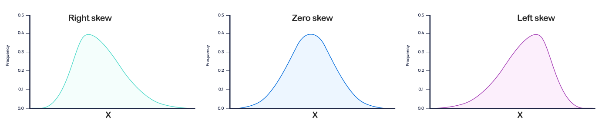
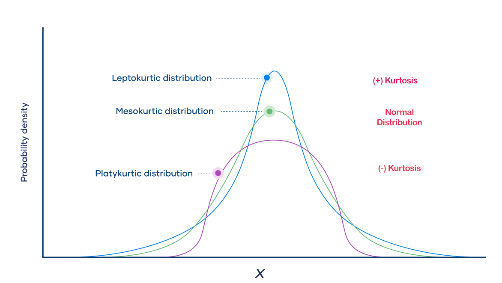

# Basic Statistics in Data Analysis

Basic statistics form the foundation of data analysis, providing essential tools and techniques for summarizing, describing, and interpreting data. Understanding these basic statistical concepts is crucial for any data analyst, as they help to make sense of data and draw meaningful conclusions. Here, we will cover some of the fundamental statistical measures and concepts commonly used in data analysis.

## Descriptive Statistics

Descriptive statistics summarize and describe the main features of a dataset. They provide simple summaries about the sample and the measures and form the basis for virtually every quantitative analysis of data.

### 1- Measures of Central Tendency:

- **Mean:** The average of a dataset, calculated by summing all values and dividing by the number of values.
  
  ```python
  mean = df['column'].mean()
  ```
- **Median:** The middle value of a dataset when it is ordered. If the dataset has an even number of observations, the median is the average of the two middle numbers.
  ```python
  median = df['column'].median()
  ```
- **Mode:** The most frequently occurring value in a dataset.
  ```python
  mode = df['column'].mode()[0]
  ```

### 2- Measures of Dispersion:

- **Range:** The difference between the maximum and minimum values in a dataset.
  
  ```python
  range = df['column'].max() - df['column'].min()
  ```
- **Variance:** Measures how far each number in the set is from the mean and thus from every other number in the set.
  ```python
  variance = df['column'].var()
  ```
- **Standard Deviation:** The square root of the variance, representing the average distance of each data point from the mean.
  ```python
  std_dev = df['column'].std()
  ```

### 3- Percentiles:

- Percentiles indicate the value below which a given percentage of observations in a group of observations fall. The 50th percentile is the median.
  ```python
  percentile_25 = df['column'].quantile(0.25)
  percentile_50 = df['column'].quantile(0.50)  # This is the median
  percentile_75 = df['column'].quantile(0.75)
  ```

## Shape of the Distribution

Understanding the shape of the distribution helps in understanding the nature of the data.

1. #### Skewness:
    Measures the asymmetry of the probability distribution of a real-valued random variable about its mean. Positive skew indicates a distribution with an asymmetric tail extending towards more positive values.

    ```python
    skewness = df['column'].skew()
    ```
    

2. #### Kurtosis:

    Measures the "tailedness" of the probability distribution. High kurtosis indicates heavy tails, while low kurtosis indicates light tails.
    
    ```python
    kurtosis = df['column'].kurt()
    ```
    

## Inferential Statistics

Inferential statistics make inferences and predictions about a population based on a sample of data.

1. ### Confidence Intervals:
    A range of values that is likely to contain the population parameter with a certain level of confidence.
   ```python
   import scipy.stats as stats
   confidence_interval = stats.norm.interval(0.95, loc=df['column'].mean(), scale=df['column'].std())
   ```

2. ### Hypothesis Testing:
    A method of making statistical decisions using experimental data. It includes tests like t-tests, chi-square tests, and ANOVA.
   
   **t-test:** Compares the means of two groups.
   
   ```python
   t_stat, p_value = stats.ttest_ind(df['group1'], df['group2'])
   ```
   
   

    **Chi-square test:** Tests the independence between categorical variables.
    
    ```python
    chi2, p, dof, ex = stats.chi2_contingency(pd.crosstab(df['var1'], df['var2']))
    ```
    
    
    
3. ### Correlation and Regression:
   - **Correlation:** Measures the strength and direction of the linear relationship between two variables.
     ```python
     correlation = df['var1'].corr(df['var2'])
     ```
   - **Regression:** Models the relationship between a dependent variable and one or more independent variables.
     ```python
     from sklearn.linear_model import LinearRegression
     
     X = df[['independent_var']]
     y = df['dependent_var']
     model = LinearRegression()
     model.fit(X, y)
     ```

## Examples and Application

To illustrate how these basic statistics are applied, let's consider a dataset of house prices, including variables like price, size, and number of bedrooms. Here’s how you might use basic statistics in this context:

1. **Summary Statistics:**
   ```python
   import pandas as pd
   
   df = pd.read_csv('house_prices.csv')
   print(df.describe())
   ```

   This will give you an overview of the central tendency, dispersion, and shape of the distribution of the house prices and other variables.

2. **Visualizations:**
   ```python
   import matplotlib.pyplot as plt
   import seaborn as sns
   
   # Histogram of House Prices
   plt.figure(figsize=(10, 6))
   sns.histplot(df['price'], bins=30, kde=True)
   plt.title('Distribution of House Prices')
   plt.show()
   
   # Scatter Plot of Price vs. Size
   plt.figure(figsize=(10, 6))
   sns.scatterplot(x='size', y='price', data=df)
   plt.title('House Price vs. Size')
   plt.show()
   ```

3. **Correlation:**
   ```python
   correlation = df['price'].corr(df['size'])
   print(f'Correlation between Price and Size: {correlation}')
   ```

4. **Hypothesis Testing:**
   ```python
   t_stat, p_value = stats.ttest_ind(df[df['bedrooms'] == 3]['price'], df[df['bedrooms'] == 4]['price'])
   print(f'T-statistic: {t_stat}, P-value: {p_value}')
   ```

Understanding these basic statistical concepts and techniques is crucial for effective data analysis. They provide the tools needed to summarize data, uncover patterns, and make informed decisions based on data. Mastery of these fundamentals forms the backbone of more advanced statistical and data analysis methods.

---

## Reading Materials

https://www.scribbr.com/statistics/skewness/

https://www.scribbr.com/statistics/kurtosis/