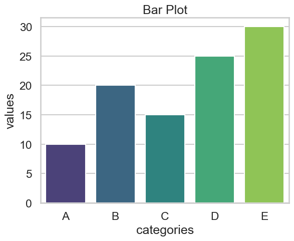

# Data Visualization Basics

## Introduction to Data Visualization

Data visualization is the graphical representation of information and data. By using visual elements like charts, graphs, and maps, data visualization tools provide an accessible way to see and understand trends, outliers, and patterns in data.

## Importance of Data Visualization

- **Exploratory Data Analysis (EDA):** Helps in understanding the data and discovering patterns.
- **Communication:** Simplifies the presentation of complex data.
- **Decision Making:** Aids in making data-driven decisions.

## Choosing the right visualization

Choosing the right visualization depends on several factors:

- **The type of data:** Different data types require different visualization techniques.
- **The purpose of the visualization:** Are you trying to show trends, compare groups, or reveal relationships?
- **The audience:** Consider the level of technical expertise and the intended message.


---

## Getting Started with Matplotlib

Matplotlib is a powerful library in Python for creating static, animated, and interactive visualizations. When starting with Matplotlib, it's crucial to understand its basic functionalities and some best practices to create effective and informative plots. Here's a guide to help you get started.

### Installation
First, you need to install Matplotlib. You can install it using pip:
```bash
pip install matplotlib
```

### Importing Matplotlib
Import the necessary modules to start plotting. Typically, you'll import `matplotlib.pyplot` as `plt`:
```python
import matplotlib.pyplot as plt
```

### Basic Plot Structure
Understanding the basic structure of a plot in Matplotlib is essential. A typical plot includes:

- **Figure:** The entire window or page that can contain multiple plots.
- **Axes:** The area on which data is plotted (a figure can have multiple axes).

### Creating a Basic Plot
Let's start with a simple line plot:
```python
# Sample data
x = [1, 2, 3, 4, 5]
y = [10, 14, 19, 25, 30]

# Creating a line plot
plt.plot(x, y)

# Adding labels and title
plt.xlabel('X-axis Label')
plt.ylabel('Y-axis Label')
plt.title('Basic Line Plot')

# Display the plot
plt.show()
```


### Key Considerations

**1- Data Preparation**

   Ensure your data is clean and structured. Matplotlib works well with lists, NumPy arrays, and Pandas DataFrames.

**2- Figure and Axes**

Understand how to create and manipulate figures and axes. This is especially useful for creating complex, multi-plot figures.
   ```python
   fig, axs = plt.subplots(2, 2)  # Create a 2x2 grid of subplots
   
   axs[0, 0].plot(x, y)
   axs[0, 0].set(xlabel='X-axis0 Label', ylabel='Y-axis0 Label', title='Basic Line Plot')
   
   axs[0, 1].plot(x, y)
   axs[0, 1].set(xlabel='X-axis0 Label', ylabel='Y-axis1 Label', title='Basic Line Plot')
   
   axs[1, 0].plot(x, y)
   axs[1, 0].set(xlabel='X-axis1 Label', ylabel='Y-axis0 Label', title='Basic Line Plot')
   
   axs[1, 1].plot(x, y)
   axs[1, 1].set(xlabel='X-axis1 Label', ylabel='Y-axis1 Label', title='Basic Line Plot')
   
   fig.set_size_inches(15, 10)  # Set the figure size
   fig.suptitle('Multiple Subplots Example')
   plt.show()
   ```


**3-Customizing Plots**

Customize your plots to make them more informative and visually appealing. This includes:
   - **Colors and Styles:** Customize line colors, styles, and markers.
   - **Labels and Titles:** Add and format labels and titles.
   - **Grid:** Add a grid for better readability.
   - **Limits:** Set axis limits to focus on specific data ranges.
   - **Annotations:** Annotate important data points for clarity.
   ```python
   plt.plot(x, y, marker='o', linestyle='--', color='g')
   plt.xlabel('X-axis')
   plt.ylabel('Y-axis')
   plt.title('Customized Plot')
   plt.grid(True)
   plt.xlim(0, 6)
   plt.ylim(5, 35)
   plt.show()
   ```


**4- Saving Plots**

   Save your plots for future use or sharing. Matplotlib supports various file formats like PNG, PDF, SVG, and more.
   ```python
   plt.plot(x, y)
   plt.xlabel('X-axis Label')
   plt.ylabel('Y-axis Label')
   plt.title('Save Plot Example')
   plt.savefig('plot.png')  # Save the plot as a .png file
   plt.show()
   ```

**5- Understanding Plot Types**

   Matplotlib supports various plot types. Some common ones include:
   - **Line Plot:** For continuous data over intervals.
   - **Scatter Plot:** For visualizing the relationship between two numerical variables.
   - **Bar Plot:** For categorical data comparison.
   - **Histogram:** For distribution of numerical data.
   - **Box Plot:** For summary statistics of data.
   - **Pie Chart:** For parts of a whole.

### Example: Creating Multiple Plots

To create multiple plots in a single figure, use the `subplot` function:
```python
fig, axs = plt.subplots(2, 2, figsize=(10, 10))  # 2x2 grid of subplots

# First subplot
axs[0, 0].plot(x, y)
axs[0, 0].set_title('Line Plot')

# Second subplot
axs[0, 1].scatter(x, y)
axs[0, 1].set_title('Scatter Plot')

# Third subplot
categories = ['A', 'B', 'C', 'D', 'E']
values = [10, 20, 15, 25, 30]
axs[1, 0].bar(categories, values)
axs[1, 0].set_title('Bar Plot')

# Fourth subplot
data = [np.random.randn(100) for _ in range(5)]
axs[1, 1].boxplot(data)
axs[1, 1].set_title('Box Plot')

plt.tight_layout()  # Adjust subplots to fit in the figure area.
plt.show()
```


## Getting Started with Seaborn

Seaborn is a powerful and versatile visualization library built on top of Matplotlib that makes it easier to create aesthetically pleasing and informative statistical graphics. Here are the instructions for getting started with Seaborn, including key considerations and best practices.

First, you need to install Seaborn. You can install it using pip:

```bash
pip install seaborn
```

### Importing Seaborn
Import the necessary modules to start plotting. Typically, you'll import Seaborn as `sns` and also Matplotlib's `pyplot` for additional customization:
```python
import seaborn as sns
import matplotlib.pyplot as plt
```

### Basic Plot Structure
Seaborn works seamlessly with Pandas DataFrames and NumPy arrays. It simplifies the creation of various types of plots with less code and more powerful defaults compared to Matplotlib.

### Creating a Basic Plot
Let's start with a simple line plot using Seaborn:
```python
# Sample data
x = [1, 2, 3, 4, 5]
y = [10, 14, 19, 25, 30]

# Creating a line plot
sns.lineplot(x=x, y=y)
plt.xlabel('X-axis Label')
plt.ylabel('Y-axis Label')
plt.title('Basic Line Plot')
plt.show()
```

### Key Considerations

**1-  Data Preparation**

Ensure your data is clean and structured. Seaborn works well with Pandas DataFrames, which makes it easier to handle and manipulate data.
   ```python
   data = pd.DataFrame({
    'x': [1, 2, 3, 4, 5],
    'y': [10, 14, 19, 25, 20]
})
# Creating a line plot
sns.lineplot(x=data['x'], y=data['y'])
plt.xlabel('X-axis Label')
plt.ylabel('Y-axis Label')
plt.title('Basic Line Plot')
plt.show()
   ```

**2- Figure Aesthetics **

   Seaborn comes with several built-in themes and color palettes that you can use to enhance the aesthetics of your plots.
   ```python
   sns.set_theme(style="darkgrid")  # Set theme for all plots
   ```

**3- Customizing Plots**

   Customize your plots to make them more informative and visually appealing. This includes:
   - **Colors and Styles:** Use different color palettes and styles.
   - **Labels and Titles:** Add and format labels and titles.
   - **Context:** Set the context for different applications (e.g., paper, notebook, talk, poster).
   ```python
   sns.set_context("talk")  # Suitable for presentations
   sns.lineplot(x='x', y='y', data=data, marker='o')
   plt.xlabel('X-axis')
   plt.ylabel('Y-axis')
   plt.title('Customized Line Plot')
   plt.show()
   ```


**4- Understanding Plot Types**

Seaborn supports a variety of plot types, each suitable for different kinds of data visualization needs. Here are some common plots and their use cases:

#### Line Plots
Used for continuous data and time series analysis.
```python
sns.lineplot(x='x', y='y', data=data)
plt.title('Line Plot')
plt.show()
```

#### Scatter Plots
Used to show relationships between two numerical variables.
```python
# Sample data
data = pd.DataFrame({
    'x': [1, 2, 3, 4, 5],
    'y': [10, 14, 19, 25, 30],
    'size': [50, 100, 200, 300, 400],
    'color': ['red', 'blue', 'green', 'purple', 'orange']
})

sns.scatterplot(x='x', y='y', size='size', hue='color', data=data, palette='coolwarm', edgecolor='w', sizes=(50, 400))
plt.title('Scatter Plot')
plt.show()
```

#### Bar Plots
Used for categorical data comparison.
```python
# Sample data
categories = ['A', 'B', 'C', 'D', 'E']
values = [10, 20, 15, 25, 30]
data = pd.DataFrame({'categories': categories, 'values': values})

sns.barplot(x='categories', y='values', data=data, palette='viridis')
plt.title('Bar Plot')
plt.show()
```



#### Histograms

Used for visualizing the distribution of a dataset.
```python
# Sample data
import numpy as np
data = np.random.randn(1000)

sns.histplot(data, bins=30, kde=True)
plt.title('Histogram with KDE')
plt.show()
```


#### Box Plots

Used to display the distribution of data and identify outliers.
```python
# Sample data
data = [np.random.randn(8) for _ in range(5)]
df = pd.DataFrame(data).melt(var_name='Category', value_name='Value')

sns.boxplot(x='Category', y='Value', data=df, palette='Set3')
plt.title('Box Plot')
plt.show()
```


#### Violin Plots

Used to show the distribution of data across different categories.
```python
data = [np.random.randn(8) for _ in range(5)]
df = pd.DataFrame(data).melt(var_name='Category', value_name='Value')

sns.violinplot(x='Category', y='Value', data=df, inner='quartile', palette='muted')
plt.title('Violin Plot')
plt.show()
```


### Saving Plots

Save your plots for future use or sharing. Seaborn plots can be saved using Matplotlib's `savefig` function.
```python
sns.lineplot(x='x', y='y', data=data)
plt.xlabel('X-axis Label')
plt.ylabel('Y-axis Label')
plt.title('Save Plot Example')
plt.savefig('seaborn_plot.png')  # Save the plot as a .png file
plt.show()
```

## Best Practice for working with Matplotlib and Seaborn

1. **Start Simple:** Begin with basic plots and gradually add complexity.
2. **Readability:** Ensure your plots are easy to read by using appropriate labels, titles, and legends.
3. **Consistency:** Maintain consistency in colors, styles, and labels across similar plots.
4. **Documentation:** Refer to the [Matplotlib documentation](https://matplotlib.org/stable/contents.html)  and [Seaborn documentation](https://seaborn.pydata.org/) for detailed information and examples.
5. **Themes and Styles:** Use Seaborn's themes and color palettes to enhance plot aesthetics.
6. **Experiment and Iterate:** Experiment with different plot types and customization options to find the most effective visualization for your data.


---

## Optional Reading Topics:


### The type of data

The type of data plays a crucial role in choosing the right data visualization technique. Different data types have different characteristics and require specific approaches to be effectively represented. Here's a breakdown of the main data types and how they influence visualization choices:

**1. Categorical Data:**

- This type of data represents categories or groups, such as product types, customer demographics, or website traffic sources.
- Examples: Customer age group (e.g., 20-25, 26-30), product categories (e.g., clothing, electronics), website traffic sources (e.g., organic search, social media).
- Suitable visualizations: Bar charts, pie charts, stacked charts, heatmaps.

**2. Numerical Data:**

- This type of data represents quantities or measurements that can be counted or measured, like sales figures, temperature readings, or survey responses.
- Examples: Sales revenue, product prices, customer satisfaction scores, temperature over time.
- Suitable visualizations: Line charts, scatter plots, histograms, boxplots, area charts.

**3. Ordinal Data:**

- This type of data represents categories with a defined order, such as customer satisfaction ratings (1-5 stars), employee performance levels (excellent, good, average, poor), or school grades (A, B, C).
- Examples: Customer satisfaction ratings, employee performance evaluations, school grades.
- Suitable visualizations: Bar charts, line charts, stacked charts.

**4. Geographic Data:**

- This type of data relates to locations and can be represented by latitude and longitude coordinates.
- Examples: Population distribution, disease outbreaks, store locations.
- Suitable visualizations: Choropleth maps, heatmaps, bubble maps.

**5. Time-Series Data:**

- This type of data represents values collected over time, like daily sales figures, monthly website traffic, or hourly temperature readings.
- Examples: Daily stock prices, monthly website traffic, hourly temperature readings.
- Suitable visualizations: Line charts, area charts, time series plots.

It's important to understand the characteristics of your data to choose the most effective visualization. Matching the data type with the appropriate visualization ensures clear and accurate communication of your insights.
