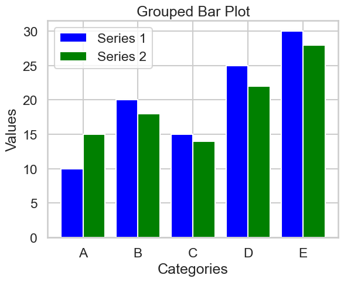

# Line Plots, Scatter Plots, Bar Plots

## 1. Line Plots

### What is a Line Plot?
A line plot displays information as a series of data points called 'markers' connected by straight line segments. It is often used to visualize a trend in data over time.

### Key Characteristics
- **Trend Analysis:** Shows trends over time or other ordered sequences.
- **Continuous Data:** Best for continuous data with an inherent order.
- **Comparative Analysis:** Multiple lines can compare different datasets.

### Use Cases
- **Time Series Analysis:** Tracking changes over time (e.g., stock prices, temperature changes).
- **Performance Monitoring:** Monitoring performance metrics over time (e.g., CPU usage).
- **Scientific Data:** Displaying experimental results or growth rates.
- **Forecasting:** Projecting future values based on historical trends.

### Creating Line Plots with Matplotlib
```python
import matplotlib.pyplot as plt

# Sample data
x = [1, 2, 3, 4, 5]
y = [10, 14, 19, 25, 30]

plt.plot(x, y, marker='o')
plt.xlabel('X-axis Label')
plt.ylabel('Y-axis Label')
plt.title('Basic Line Plot')
plt.grid(True)
plt.show()
```

### Customizing Line Plots in Matplotlib
```python
plt.plot(x, y, marker='o', linestyle='--', color='g', linewidth=2, markersize=10)
plt.xlabel('X-axis')
plt.ylabel('Y-axis')
plt.title('Customized Line Plot')
plt.xlim(0, 6)
plt.ylim(5, 35)
plt.grid(True)
plt.show()
```

### Creating Line Plots with Seaborn
```python
import seaborn as sns

sns.lineplot(x=x, y=y, marker='o')
plt.title('Seaborn Line Plot')
plt.show()
```

### Customizing Line Plots in Seaborn
```python
sns.set(style='whitegrid')
sns.lineplot(x=x, y=y, marker='o')
plt.title('Customized Seaborn Line Plot')
plt.show()
```

## 2. Scatter Plots

### What is a Scatter Plot?
A scatter plot uses dots to represent values for two different numeric variables. The position of each dot on the horizontal and vertical axis indicates values for an individual data point.

### Key Characteristics
- **Relationship Analysis:** Shows relationships between two variables.
- **Outliers:** Helps identify outliers and anomalies.
- **Clusters:** Can show clustering of data points.

### Use Cases
- **Correlation Analysis:** Assessing the relationship between two variables (e.g., height vs. weight).
- **Outlier Detection:** Identifying outliers in the data.
- **Pattern Recognition:** Recognizing patterns and clusters in the data.

### Creating Scatter Plots with Matplotlib
```python
plt.scatter(x, y, c='red', marker='x')
plt.xlabel('X-axis Label')
plt.ylabel('Y-axis Label')
plt.title('Scatter Plot')
plt.show()
```

### Customizing Scatter Plots in Matplotlib
```python
sizes = [50, 100, 200, 300, 400]
colors = ['red', 'green', 'blue', 'orange', 'purple']

plt.scatter(x, y, s=sizes, c=colors, alpha=0.5, edgecolors='w', linewidth=2)
plt.xlabel('X-axis Label')
plt.ylabel('Y-axis Label')
plt.title('Customized Scatter Plot')
plt.show()
```

### Creating Scatter Plots with Seaborn
```python
sns.scatterplot(x=x, y=y, color='red')
plt.title('Seaborn Scatter Plot')
plt.show()
```

### Customizing Scatter Plots in Seaborn
```python
sns.scatterplot(x=x, y=y, size=sizes, hue=colors, palette='coolwarm', edgecolor='w', linewidth=2)
plt.title('Customized Seaborn Scatter Plot')
plt.show()
```

## 3. Bar Plots

### What is a Bar Plot?
A bar plot represents categorical data with rectangular bars. Each bar's height or length is proportional to the values they represent.

### Key Characteristics
- **Categorical Data:** Represents categorical data.
- **Comparative Analysis:** Compare different categories or groups.
- **Distribution:** Show the distribution of categorical data.

### Use Cases
- **Comparing Categories:** Comparing values across different categories (e.g., sales by region).
- **Frequency Distribution:** Displaying the frequency distribution of categorical data.
- **Survey Results:** Visualizing survey results and responses.

### Creating Bar Plots with Matplotlib
```python
categories = ['A', 'B', 'C', 'D', 'E']
values = [10, 20, 15, 25, 30]

plt.bar(categories, values)
plt.xlabel('Categories')
plt.ylabel('Values')
plt.title('Bar Plot')
plt.show()
```

### Customizing Bar Plots in Matplotlib
```python
plt.bar(categories, values, color=['red', 'blue', 'green', 'purple', 'orange'], edgecolor='black')
plt.xlabel('Categories')
plt.ylabel('Values')
plt.title('Customized Bar Plot')
plt.show()
```

### Creating Bar Plots with Seaborn
```python
sns.barplot(x=categories, y=values)
plt.title('Seaborn Bar Plot')
plt.show()
```

### Customizing Bar Plots in Seaborn
```python
sns.barplot(x=categories, y=values, palette='viridis')
plt.title('Customized Seaborn Bar Plot')
plt.show()
```

### Grouped Bar Plots
To compare multiple series of data:
```python
import numpy as np

# Sample data
categories = ['A', 'B', 'C', 'D', 'E']
values1 = [10, 20, 15, 25, 30]
values2 = [15, 18, 14, 22, 28]

# Create an array with the positions of the bars on the x-axis
bar_width = 0.4
bar_positions1 = np.arange(len(categories))
bar_positions2 = bar_positions1 + bar_width

# Create the bar plots
plt.bar(bar_positions1, values1, width=bar_width, color='blue', label='Series 1')
plt.bar(bar_positions2, values2, width=bar_width, color='green', label='Series 2')

# Adding labels and title
plt.xlabel('Categories')
plt.ylabel('Values')
plt.title('Grouped Bar Plot')
plt.xticks(bar_positions1 + bar_width / 2, categories)
plt.legend()

plt.show()
```



By mastering line plots, scatter plots, and bar plots, you can effectively visualize trends, relationships, and comparisons in your data. These basic visualizations are foundational for more advanced data analysis and presentation.