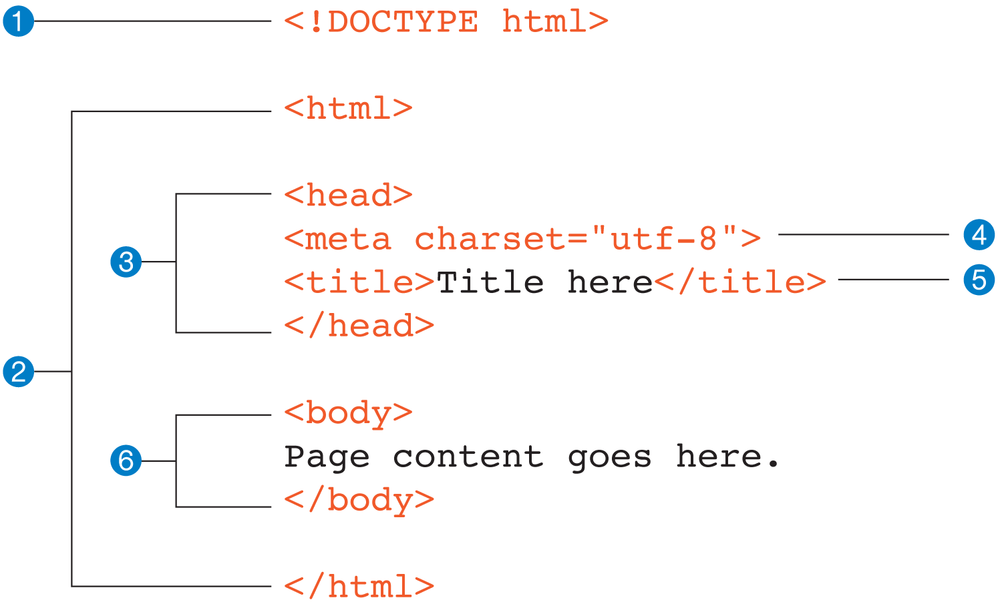

# Introduction to HTML

HTML (HyperText Markup Language) is the standard language used to create and structure content on the web. It consists of a series of elements that define different parts of a webpage, such as headings, paragraphs, links, images, and more. Understanding HTML is essential for web scraping, as it allows you to identify and extract the data you need from web pages.

## Basic Structure of an HTML Document

An HTML document has a <u>hierarchical structure</u>, which can be visualized as a tree with <u>nested elements</u>. Here's an example of a simple HTML document:

```html
<!DOCTYPE html>

<html>
    <head>
        <meta charset="utf-8">
        <title>Ttile hear</title> <!-- This title shows on browser tab -->
    </head>
    <body>
        Page content goes here.
    </body>
</html>
```



**Key Elements Explained:**

1. `<!DOCTYPE html>`: This declaration defines the document type and version of HTML. It ensures the document is interpreted correctly by the browser.
2. `<html>`: The root element of an HTML document. All other elements are contained within this tag.
3. `<head>`: Contains meta-information about the document, such as the title, character set, styles, and scripts.
4. `<title>`: Sets the title of the webpage, which appears in the browser's title bar or tab.
5. `<body>`: Contains the content of the webpage that is visible to users.

## Common HTML Tags and Their Uses:

- **Headings (`<h1>` to `<h6>`):** Define headings of different levels. `<h1>` is the highest level and is typically used for the main title, while `<h6>` is the lowest level.
  
  ```html
  <h1>Main Title</h1>
  <h2>Subheading</h2>
  ```
  
- **Paragraphs (`<p>`):** Define blocks of text.
  ```html
  <p>This is a paragraph of text.</p>
  ```

- **Links (`<a>`):** Create hyperlinks to other web pages or resources.
  ```html
  <a href="https://www.example.com">Click here to visit Example</a>
  ```

- **Images (``):** Embed images into the webpage.
  ```html
  
  ```

- **Lists (`<ul>`, `<ol>`, `<li>`):** Create unordered (bulleted) and ordered (numbered) lists.
  ```html
  <ul>
      <li>First item</li>
      <li>Second item</li>
  </ul>
  
  <ol>
      <li>First item</li>
      <li>Second item</li>
  </ol>
  ```

- **Tables (`<table>`, `<tr>`, `<td>`, `<th>`):** Organize data in tabular form.
  ```html
  <table>
      <tr>
          <th>Header 1</th>
          <th>Header 2</th>
      </tr>
      <tr>
          <td>Data 1</td>
          <td>Data 2</td>
      </tr>
  </table>
  ```

## Tags, Attributes, and Values

### HTML Tags

HTML tags are the building blocks of HTML. They define the structure and content of a webpage. Tags are enclosed in angle brackets (`<>`) and usually come in pairs: an opening tag and a closing tag. The closing tag is similar to the opening tag but includes a forward slash (`/`) before the tag name.

**Examples of HTML Tags:**
- **Paragraph Tag (`<p>`):** Defines a paragraph of text.
  ```html
  <p>This is a paragraph.</p>
  ```

- **Anchor Tag (`<a>`):** Defines a hyperlink.
  ```html
  <a href="https://www.example.com">Visit Example</a>
  ```

- **Image Tag (``):** Embeds an image.
  ```html
  
  ```

### HTML Attributes

Attributes provide additional information about HTML elements. They are always included in the opening tag and are written as name-value pairs, separated by an equal sign (`=`). The value is enclosed in double quotes (`"`).

**Common HTML Attributes:**

- **`id`:** Provides a unique identifier for an element.
  ```html
  <div id="header">This is the header section.</div>
  ```

- **`class`:** Specifies one or more class names for an element, which can be used for styling or scripting.
  ```html
  <p class="highlight">This is a highlighted paragraph.</p>
  ```

- **`src`:** Specifies the URL of an external resource, such as an image.
  ```html
  
  ```

- **`href`:** Specifies the URL of a link.
  ```html
  <a href="https://www.example.com">Visit Example</a>
  ```

- **`alt`:** Provides alternative text for an image, which is displayed if the image cannot be loaded.
  ```html
  
  ```

- **`title`:** Provides additional information about an element, often displayed as a tooltip when the mouse hovers over the element.
  ```html
  <p title="Tooltip text">Hover over this paragraph to see the tooltip.</p>
  ```

**Example:**
Let's take a look at an example that includes several attributes:

```html
<a href="https://www.example.com" target="_blank" rel="noopener noreferrer" title="Visit Example">Visit Example</a>
```

**Attributes Explained:**
- **`href="https://www.example.com"`:** Specifies the URL to which the link points.
- **`target="_blank"`:** Opens the link in a new tab or window.
- **`rel="noopener noreferrer"`:** Improves security by preventing the new page from gaining access to the previous page's `window` object.
- **`title="Visit Example"`:** Displays "Visit Example" as a tooltip when the user hovers over the link.

### Understanding Attribute Values

Attribute values provide the specific information or setting for an attribute. They are always enclosed in double quotes (`"`), although single quotes (`'`) can also be used. The value should be relevant to the attribute to ensure the element behaves as expected.

**Examples of Attribute Values:**

- **Unique Identifier:**
  ```html
  <div id="main-content">Main content goes here.</div>
  ```

- **Class Name:**
  ```html
  <span class="important">Important text</span>
  ```

- **Source URL:**
  ```html
  
  ```

- **Hyperlink Reference:**
  ```html
  <a href="https://www.example.com">Example</a>
  ```

- **Alternative Text:**
  ```html
  
  ```

## Example 1: Scraping Product Information

Imagine you are tasked with scraping product information from an e-commerce website. The product page contains the following HTML structure:

```html
<div class="product" id="product-123">
    <h2 class="product-name">Awesome Widget</h2>
    <p class="price">$19.99</p>
    
</div>
```

To extract the product details, you need to understand the tags, attributes, and values:

- **Product Name:**
  ```html
  <h2 class="product-name">Awesome Widget</h2>
  ```
  - Tag: `<h2>`
  - Attribute: `class="product-name"`
  - Value: `"product-name"`

- **Price:**
  ```html
  <p class="price">$19.99</p>
  ```
  - Tag: `<p>`
  - Attribute: `class="price"`
  - Value: `"price"`

- **Product Image:**
  ```html
  
  ```
  - Tag: ``
  - Attributes: `class="product-image"`, `src="widget.jpg"`, `alt="Awesome Widget"`
  - Values: `"product-image"`, `"widget.jpg"`, `"Awesome Widget"`

## Example 2: Scraping Product Reviews

Imagine you want to scrape product reviews from an e-commerce website to analyze customer feedback. Each product page contains a list of reviews, with each review including the reviewer's name, rating, date of review, and the review text.

Here is a sample HTML structure for a product review section:

```html
<div class="product-reviews">
    <div class="review" id="review-001">
        <h3 class="reviewer-name">John Doe</h3>
        <span class="rating">5 stars</span>
        <time class="review-date" datetime="2023-06-01">June 1, 2023</time>
        <p class="review-text">This product is amazing! Highly recommended.</p>
    </div>
    <div class="review" id="review-002">
        <h3 class="reviewer-name">Jane Smith</h3>
        <span class="rating">4 stars</span>
        <time class="review-date" datetime="2023-05-15">May 15, 2023</time>
        <p class="review-text">Very good product, but could use some improvements.</p>
    </div>
    <!-- More reviews -->
</div>
```

To extract the reviews, you'll need to identify and target the specific elements containing the data you want.

**Step-by-Step Extraction:**

1. **Identify the Review Container:**
   - The reviews are contained within the `<div class="product-reviews">` element.
   
2. **Locate Each Review:**
   - Each review is inside a `<div class="review" id="review-***">` element.

3. **Extract Review Details:**
   
   - **Reviewer Name:**
     ```html
     <h3 class="reviewer-name">John Doe</h3>
     ```
     - Tag: `<h3>`
     - Attribute: `class="reviewer-name"`
     - Value: `"reviewer-name"`
   
   - **Rating:**
     ```html
     <span class="rating">5 stars</span>
     ```
     - Tag: `<span>`
     - Attribute: `class="rating"`
     - Value: `"rating"`
   
   - **Review Date:**
     ```html
     <time class="review-date" datetime="2023-06-01">June 1, 2023</time>
     ```
     - Tag: `<time>`
     - Attribute: `class="review-date"`
     - Value: `"review-date"`
     - Additional Attribute: `datetime="2023-06-01"`
   
   - **Review Text:**
     ```html
     <p class="review-text">This product is amazing! Highly recommended.</p>
     ```
     - Tag: `<p>`
     - Attribute: `class="review-text"`
     - Value: `"review-text"`

**Putting It All Together:**

Here's a Python script using BeautifulSoup to scrape these reviews:

```python
from bs4 import BeautifulSoup

# Sample HTML content (in a real scenario, you'd fetch this with the requests library)
html_content = '''
<div class="product-reviews">
    <div class="review" id="review-001">
        <h3 class="reviewer-name">Ali</h3>
        <span class="rating">5 stars</span>
        <time class="review-date" datetime="2024-06-01">June 1, 2023</time>
        <p class="review-text">This product is amazing! Highly recommended.</p>
    </div>
    <div class="review" id="review-002">
        <h3 class="reviewer-name">Hassan</h3>
        <span class="rating">4 stars</span>
        <time class="review-date" datetime="2024-05-15">May 15, 2023</time>
        <p class="review-text">Very good product, but could use some improvements.</p>
    </div>
</div>
'''

# Parse the HTML content
soup = BeautifulSoup(html_content, 'html.parser')

# Find all review elements
reviews = soup.find_all('div', class_='review')

# Extract and print review details
for review in reviews:
    reviewer_name = review.find('h3', class_='reviewer-name').text
    rating = review.find('span', class_='rating').text
    review_date = review.find('time', class_='review-date')['datetime']
    review_text = review.find('p', class_='review-text').text

    print(f'Reviewer: {reviewer_name}')
    print(f'Rating: {rating}')
    print(f'Date: {review_date}')
    print(f'Review: {review_text}')
```

The output of this script will be:

```
Reviewer: Ali
Rating: 5 stars
Date: 2024-06-01
Review: This product is amazing! Highly recommended.

Reviewer: Hassan
Rating: 4 stars
Date: 2024-05-15
Review: Very good product, but could use some improvements.
```

**Explanation:**

1. **Parse HTML Content:** Using BeautifulSoup to parse the HTML content.
2. **Find Review Elements:** Locate all `<div>` elements with the class `review`.
3. **Extract Details:**
   - **Reviewer Name:** Extract the text inside the `<h3 class="reviewer-name">` element.
   - **Rating:** Extract the text inside the `<span class="rating">` element.
   - **Review Date:** Extract the `datetime` attribute from the `<time class="review-date">` element.
   - **Review Text:** Extract the text inside the `<p class="review-text">` element.

This example demonstrates how multiple pieces of data are extracted from nested HTML elements. Understanding how to navigate and extract data from such structures is crucial for effective web scraping.

## Inspecting HTML Elements

To effectively scrape data from a website, it's crucial to inspect the HTML structure of the webpage. Most modern web browsers provide developer tools that allow you to inspect and manipulate the HTML and CSS of a webpage.

**Using Browser Developer Tools:**

1. **Open Developer Tools:** In most browsers, you can right-click on a webpage and select "Inspect" or "Inspect Element." Alternatively, you can press `F12` or `Ctrl+Shift+I` (`Cmd+Option+I` on Mac).
2. **Inspect Elements:** Use the "Elements" tab to see the HTML structure of the webpage. Hover over elements in the HTML panel to highlight them on the webpage.
3. **Explore Properties:** Click on an element to see its attributes, such as `id`, `class`, `src`, and `href`. This is useful for identifying the specific elements you need to scrape.

Understanding how to work with HTML tags, attributes, and values is important for effectively scraping data from web pages. Each element on a webpage can have multiple attributes, and recognizing these attributes helps you target specific pieces of data accurately.

---

**How to Use Inspect Element in Chrome, Safari, & Firefox**

https://blog.hubspot.com/website/how-to-inspect