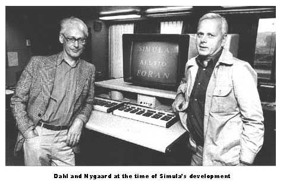
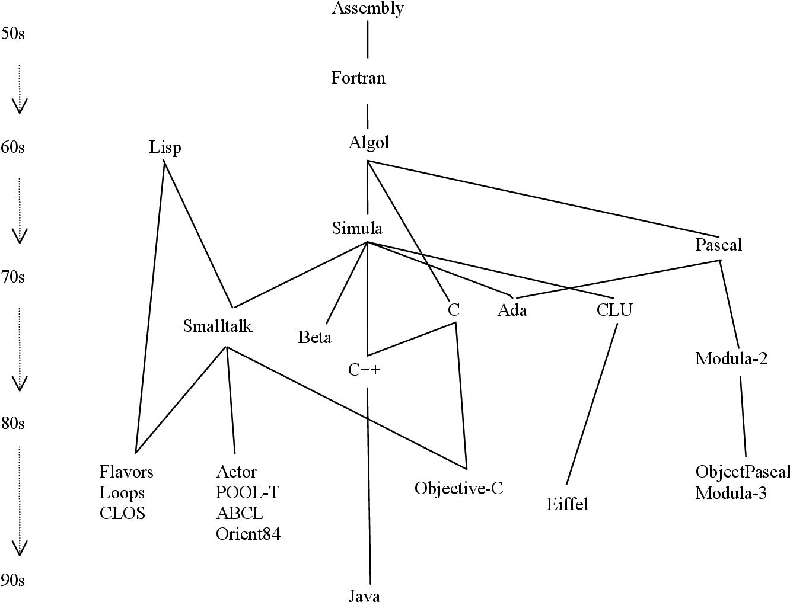
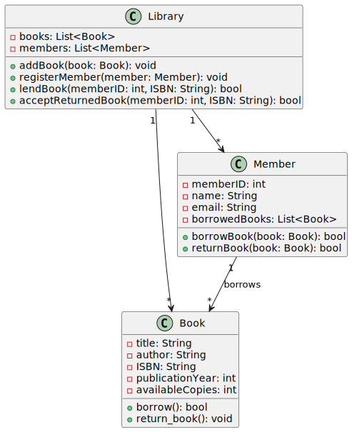

# Introduction to Object-Oriented Paradigm

Object-oriented techniques, or paradigms, represent a cornerstone in the realm of software development, offering a structured approach to designing and building software systems. These techniques have evolved over the decades, significantly transforming how developers conceptualize and implement complex applications. This introduction delves into the history, benefits, use cases, and fundamental principles of object-oriented paradigms, providing a comprehensive understanding of their significance and application.

## Definition of Object-Oriented

**Object-oriented** is a comprehensive approach that encompasses not only programming but also analysis and design. This paradigm is centered around the concept of "objects," which are discrete entities that encapsulate both data and behaviors. In the context of object-oriented systems, an object can be anything that has a distinct identity and a set of attributes and methods. This approach structures complex systems by decomposing them into these objects, making it easier to manage, understand, and develop software that mirrors real-world scenarios.

> Looking at it quite literally, labelling something as ‘object-oriented’ implies that objects play a central role, and we elaborate this further as ***a perspective that views the elements of a given situation by decomposing them into objects and object relationships.***
> 
> In a broad sense, this idea could apply to any setting and examples of its application can in fact be found in business, chemistry, engineering and, even philosophy.

In the object-oriented paradigm, the focus on objects allows for a more natural and intuitive representation of real-world entities and their interactions. This paradigm enables developers to model a system's requirements by identifying the key objects involved, their attributes, and the behaviors they exhibit. By encapsulating data and methods within objects, the system becomes modular, promoting reusability and maintainability. This encapsulation ensures that objects are self-contained units, reducing dependencies and improving the system's robustness.

Object-oriented analysis, design, and programming form a cohesive methodology that guides the development of software systems from concept to implementation. During the analysis phase, developers examine the problem domain and identify the objects that are essential to the system. This involves understanding the relationships between objects and how they collaborate to achieve the desired functionality. The design phase then takes these objects and defines their interactions in detail, creating a blueprint for the system's architecture. Finally, in the programming phase, this design is translated into code using an object-oriented programming language, bringing the system to life. This comprehensive approach ensures that the system is well-structured, scalable, and aligned with real-world needs.

## Historical Background

The origins of object-oriented can be traced back to the 1960s with the development of Simula, a programming language designed for simulation tasks. Simula, created by Ole-Johan Dahl and Kristen Nygaard, introduced the concept of classes and objects, laying the groundwork for future object-oriented languages. The idea was to model real-world entities and their interactions within the software, thereby simplifying the simulation of complex systems.



In the 1970s, Smalltalk, developed at Xerox PARC by Alan Kay, Dan Ingalls, and Adele Goldberg, emerged as the first true object-oriented language. Smalltalk was designed to be a purely object-oriented language, emphasizing the principles of encapsulation, inheritance, and polymorphism. Alan Kay’s vision of a “Dynabook” – a portable, personal computer – heavily influenced Smalltalk’s development, highlighting the potential of object-oriented paradigms in creating intuitive and powerful computing environments.

The 1980s saw the advent of C++, developed by Bjarne Stroustrup, which combined the efficiency of C with the powerful abstraction mechanisms of object-oriented programming. C++ popularized the use of object-oriented techniques in mainstream software development, leading to the widespread adoption of these paradigms.

The 1990s and 2000s witnessed further advancements with the introduction of languages like Java and C#. Java, developed by Sun Microsystems, emphasized platform independence and robust object-oriented design, becoming a staple in web and enterprise applications. C#, developed by Microsoft, integrated seamlessly with the .NET framework, providing a modern, object-oriented language for Windows-based applications.



https://programminglanguages.info/language/simula/

## Understanding Object-Oriented Development

Initially, computer programs were conceived as processes encoded to be run on a computer. This idea came from the fact that early computers were primarily designed to automate well-defined numerical computation algorithms, dating back to the first stored-program computers. Consequently, software creation was seen as translating a description from a 'natural' language into a sequence of operations executable by a computer. While this approach is still effective for teaching beginners about programming, its limitations became apparent as systems grew in complexity. Over time, software developers shifted their perspective due to factors such as the high cost of development and the constant drive to apply software in new areas.

Two main characteristics began to distinguish newer software applications:

1. Behaviors that were challenging to define as processes.
2. Requirements for reliability, performance, and cost that earlier developers did not encounter.

The traditional process-centric approach to software development employed **top-down functional decomposition**. This method started by defining the process's outputs and inputs, then breaking the process into functional modules. Data structures were designed, and the computation was executed by calling these modules, which manipulated the stored data. However, this design's rigidity meant that any changes to the process specification (more frequent in business applications than in numerical algorithms) necessitated a complete program overhaul. This made reusing code difficult and costly. Consequently, software designers began to reevaluate their methods and study design principles from other engineering fields.

This interdisciplinary exchange of ideas led to the birth of software design and software engineering. An illustrative example can be seen in the design of simple electromechanical systems. For many years, even individuals with minimal engineering knowledge could design and build simple systems in their garages or backyards, making it a popular hobby even for children. The success of this approach lies in its understandable designs, standard solutions for various problems, a well-defined library of building blocks, and interchangeable components. Software design pioneers began to consider whether similar principles could apply to software development. This consideration led to the evolution of the object-oriented paradigm.

Despite the fundamental differences between software and hardware, many principles of good software design align with those of hardware design. Today's best practices in software design advocate a methodology that includes a step-by-step design process, a language for specifying outputs at each stage to ensure seamless transitions, the reuse of previous designs, standard solutions based on sound design principles, and the ability to incrementally improve poor designs without disrupting the system.

Object-oriented development revolves around defining a software system as a collection of objects of different types that interact through well-defined interfaces. Unlike hardware components, software objects can handle multiple functions and participate in various processes. They can also store data, adding complexity. This approach moves away from the traditional process-oriented view by first analyzing all processes to identify the necessary software components. Each component represents a data abstraction designed to store information and procedures for manipulating it. The processes are then divided into steps, each assigned to a specific software component. These components communicate with each other as needed to complete the processes.

## Object-Oriented Analysis, Design, and Programming

Object-oriented techniques encompass a series of stages that include analysis, design, and programming. These stages are interrelated, each building on the previous to create robust, maintainable software. Understanding these stages is crucial for leveraging the full potential of object-oriented methodologies.


### 1. Object-Oriented Analysis (OOA)

**Object-Oriented Analysis** is the process of understanding and modeling a problem domain by identifying and defining the objects and their interactions. This stage focuses on gathering requirements and establishing a conceptual model that reflects the system's functionality and behavior.

#### Key Aspects of Object-Oriented Analysis:

- **Requirement Gathering:**
  
  Understand the problem domain by collecting requirements from stakeholders. Use techniques like interviews, surveys, and workshops to gather detailed information.

- **Identify Objects and Classes:**
  
  Determine the key entities in the problem domain that will be represented as objects. Group similar objects into classes, defining their attributes and behaviors.
  
  Example: In a library system, objects might include `Book`, `Member`, and `Librarian`.

- **Define Relationships:**
  
  Establish how objects interact with each other, including associations, aggregations, and compositions.
  
  Example: A `Member` borrows a `Book`, representing an association between these classes.

- **Create Use Cases:**
  
  Develop use cases to describe the interactions between users (actors) and the system. Use case diagrams can visualize these interactions.
  
  Example: A use case for a library system might be "Borrow a Book," showing the steps a `Member` takes to borrow a `Book`.

- **Model Behavior:**
  
  Define how objects behave in response to events, using sequence diagrams or state diagrams.
  
  Example: A sequence diagram might show the process of checking out a book, including interactions between `Member`, `Librarian`, and `Book` objects.

### 2. Object-Oriented Design (OOD)

**Object-Oriented Design** is the process of translating the conceptual model from the analysis phase into a detailed design that can be implemented using object-oriented programming. This stage focuses on defining the system architecture, including detailed **class designs** and their interactions.

#### Key Aspects of Object-Oriented Design:

- **Refine Classes and Objects:**
  
  Enhance the definitions of classes and objects identified during analysis, including detailed attributes and methods.
  
  Example: Define the `Book` class with attributes like `title`, `author`, and `ISBN`, and methods like `borrow()` and `return()`.

- **Define Class Hierarchies:**
  
  Establish inheritance relationships to promote code reuse and define more specific subclasses.
  
  Example: Create a `PrintedBook` and an `EBook` class that inherit from the `Book` class, adding specific attributes and methods.

- **Design Interactions:**
  
  Define how objects interact at a more detailed level, using interaction diagrams like sequence diagrams.
  
  Example: A sequence diagram for the "Borrow a Book" use case might show method calls between `Member`, `Librarian`, and `Book` objects.

- **Design Patterns:**
  
  Apply design patterns to solve common design problems and improve code maintainability and flexibility.
  
  Example: Use the Singleton pattern to ensure only one instance of the `Library` class exists.

- **Architecture Design:**
  
  Define the overall system architecture, including subsystems, components, and their interactions.
  
  Example: Design the library system with subsystems for catalog management, user management, and transaction processing.

- **Define Interfaces:**
  
  Specify the interfaces for classes and components, detailing how they will interact with other parts of the system.
  
  Example: Define an interface for a `PaymentProcessor` that handles fines and fees in the library system.

### 3. Object-Oriented Programming (OOP)

**Object-Oriented Programming** is the implementation phase where the design is translated into code using an object-oriented programming language. This stage involves writing, testing, and maintaining the code based on the detailed design specifications.

#### Key Aspects of Object-Oriented Programming:

- **Class Definition:**
  
  Implement the classes defined during the design phase, including attributes and methods.
  
  Example: Implement the `Book` class in Python with attributes for `title`, `author`, and `ISBN`, and methods for `borrow()` and `return()`.

- **Object Instantiation:**
  
  Create instances of the classes to represent specific entities in the system.
  
  Example: Instantiate a `Book` object for "1984" by George Orwell.

- **Encapsulation:**
  
  Implement encapsulation to hide the internal state of objects and provide public methods for accessing and modifying that state.
  
  Example: Use private attributes and public getter/setter methods in the `Book` class.

- **Inheritance:**
  
  Implement inheritance to promote code reuse and establish a class hierarchy.
  
  Example: Define the `EBook` class that inherits from the `Book` class and adds a `file_format` attribute.

- **Polymorphism:**
  
  Implement polymorphism to allow objects to be treated as instances of their parent class.
  
  Example: Create a method that accepts any `Book` object and calls its `borrow()` method, regardless of whether it is a `PrintedBook` or an `EBook`.

- **Testing and Debugging:**
  
  Write tests to ensure the code behaves as expected and debug any issues that arise.
  
  Example: Write unit tests for the `borrow()` and `return()` methods of the `Book` class.

- **Maintenance:**
  
  Maintain and update the code as requirements change or bugs are discovered.
  
  Example: Modify the `Book` class to include a `due_date` attribute for borrowed books.

Object-oriented analysis, design, and programming are interconnected stages in the development of software using the object-oriented paradigm. **Analysis** focuses on understanding and modeling the problem domain, **design** translates this model into a detailed plan for implementation, and **programming** involves writing and maintaining the code. Together, these stages provide a systematic approach to building robust, maintainable, and scalable software systems.

### Example: Building a Library Management System

To illustrate the object-oriented paradigm, let's consider the example of developing a Library Management System. This system needs to manage books, library members, and borrowing transactions. We'll go through the stages of analysis, design, and programming to show how object-oriented concepts can be applied.

#### 1- Analysis

During the analysis phase, we identify the key entities (objects) and their interactions. Here are the primary objects we might identify:

**Book**

- Attributes: `title`, `author`, `ISBN`, `publicationYear`, `availableCopies`
- Behaviors: `borrow()`, `return()`

**Member**

- Attributes: `memberID`, `name`, `email`, `borrowedBooks`
- Behaviors: `borrowBook()`, `returnBook()`

**Library**

- Attributes: `books`, `members`
- Behaviors: `addBook()`, `registerMember()`, `lendBook()`, `acceptReturnedBook()`

The relationships between these objects are also identified. For example, a `Member` can borrow multiple `Books`, and a `Library` contains many `Books` and `Members`.

#### 2- Object-Oriented Design

In the design phase, we create detailed class diagrams and define the methods' interactions. This involves specifying the classes, their attributes, methods, and how they interact with each other.

##### Class Diagram

Here's a class diagram for the Library Management System example. The diagram shows the relationships between the `Book`, `Member`, and `Library` classes.



#### 3- Object-Oriented Programming

In the programming phase, we implement the design using an object-oriented programming language, such as Python.

**Book Class:**

```python
class Book:
    def __init__(self, title, author, ISBN, publicationYear, availableCopies):
        self.title = title
        self.author = author
        self.ISBN = ISBN
        self.publicationYear = publicationYear
        self.availableCopies = availableCopies

    def borrow(self):
        if self.availableCopies > 0:
            self.availableCopies -= 1
            return True
        return False

    def return_book(self):
        self.availableCopies += 1
```

**Member Class:**

```python
class Member:
    def __init__(self, memberID, name, email):
        self.memberID = memberID
        self.name = name
        self.email = email
        self.borrowedBooks = []

    def borrowBook(self, book):
        if book.borrow():
            self.borrowedBooks.append(book)
            return True
        return False

    def returnBook(self, book):
        if book in self.borrowedBooks:
            book.return_book()
            self.borrowedBooks.remove(book)
            return True
        return False
```

**Library Class:**

```python
class Library:
    def __init__(self):
        self.books = []
        self.members = []

    def addBook(self, book):
        self.books.append(book)

    def registerMember(self, member):
        self.members.append(member)

    def lendBook(self, memberID, ISBN):
        member = next((m for m in self.members if m.memberID == memberID), None)
        book = next((b for b in self.books if b.ISBN == ISBN), None)
        if member and book:
            return member.borrowBook(book)
        return False

    def acceptReturnedBook(self, memberID, ISBN):
        member = next((m for m in self.members if m.memberID == memberID), None)
        book = next((b for b in self.books if b.ISBN == ISBN), None)
        if member and book:
            return member.returnBook(book)
        return False
```

#### Summery

This example demonstrates how the object-oriented paradigm helps structure the development process, making it easier to analyze, design, and implement a software system that is modular, reusable, and maintainable.

**Object-Oriented Analysis:**

- We identified the key objects (Book, Member, Library) and their attributes and behaviors.
- We understood the relationships between these objects.

**Object-Oriented Design:**

- We created class diagrams to visually represent the structure of our system.
- We defined the attributes and methods for each class.

**Object-Oriented Programming:**

- We implemented the design in Python, creating classes and defining their interactions.
- We used methods to encapsulate behaviors, ensuring that objects interact in a controlled manner.

## Fundamental Principles of Object-Oriented Paradigms

Object-oriented paradigms revolve around several core principles that define the structure and behavior of software systems. These principles include:

1. **Encapsulation:**
   
   Encapsulation involves bundling the data (attributes) and methods (functions) that operate on the data into a single unit, known as a class. This principle restricts direct access to some of the object's components, promoting modularity and safeguarding the integrity of the data.

2. **Inheritance:**
   
   Inheritance allows one class to inherit the attributes and methods of another class. This promotes code reuse and establishes a hierarchical relationship between classes, enabling the creation of more specific subclasses that extend the functionality of their parent classes.

3. **Polymorphism:**
   
   Polymorphism enables objects to be treated as instances of their parent class rather than their actual class. This allows for flexibility in code, where a single interface can represent different underlying forms, such as different types of objects.

4. **Abstraction:**
   
   Abstraction involves hiding the complex implementation details and exposing only the essential features of an object. This reduces complexity and enhances the manageability of the code.

### Benefits of Object-Oriented Paradigms

Object-oriented paradigms offer several benefits that make them a preferred choice for modern software development:

1. **Modularity:**
   
   By breaking down a complex program into smaller, manageable pieces or modules, object-oriented paradigms promote modularity. Each class represents a discrete unit of functionality, which can be developed, tested, and maintained independently.

2. **Reusability:**
   
   Classes once written can be reused across different programs and projects. Inheritance and polymorphism further enhance reusability by allowing existing code to be extended and customized without duplication.

3. **Maintainability:**
   
   The modular structure of object-oriented code makes it easier to maintain and modify. Encapsulation ensures that changes to an object's internal state do not affect other parts of the system, reducing the risk of introducing errors.

4. **Scalability:**
   
   Object-oriented paradigms facilitate the development of large-scale software systems. The ability to model real-world entities and their interactions in a hierarchical manner enables developers to scale applications more effectively.

### Use Cases of Object-Oriented Paradigms

Object-oriented paradigms are widely applied across various domains, demonstrating their versatility and effectiveness:

1. **Graphical User Interfaces (GUIs):**
   
   Object-oriented techniques are ideal for designing GUIs, where elements like buttons, text fields, and windows can be represented as objects with specific properties and behaviors. Frameworks like Java Swing and Qt leverage OOP principles to create intuitive and interactive interfaces.

2. **Game Development:**
   
   In game development, object-oriented paradigms help model game entities such as players, enemies, and power-ups. Each entity can be an object with unique attributes and behaviors, facilitating the creation of complex and interactive gaming environments. Engines like Unity and Unreal Engine utilize OOP to manage game components.

3. **Web Development:**
   
   Web frameworks like Django (Python) and Ruby on Rails leverage object-oriented principles to structure web applications. Models in these frameworks represent data and business logic, while views and controllers manage the user interface and input handling, promoting a clean separation of concerns.

4. **Enterprise Software:**
   
   Large-scale enterprise applications benefit from object-oriented paradigms due to the need for modularity and maintainability. Systems like ERP (Enterprise Resource Planning) and CRM (Customer Relationship Management) are often designed using OOP to manage complex business processes and data.

5. **Simulation and Modeling:**
   
   Object-oriented paradigms are ideal for simulation and modeling complex systems. For example, in a traffic simulation, vehicles, traffic lights, and roads can be modeled as objects with specific interactions, enabling detailed analysis and experimentation.

## Conclusion

Object-oriented techniques have revolutionized software development by providing a structured and intuitive approach to designing and building complex systems. From their early beginnings with Simula and Smalltalk to their widespread adoption in modern languages like Java and Python, object-oriented paradigms have demonstrated their efficacy in promoting modularity, reusability, maintainability, and scalability.

By understanding the fundamental principles of encapsulation, inheritance, polymorphism, and abstraction, developers can harness the power of object-oriented paradigms to create robust and efficient software solutions. Whether in graphical user interfaces, game development, web applications, enterprise software, or simulation, the benefits of object-oriented techniques are evident, making them an essential component of contemporary software engineering.
