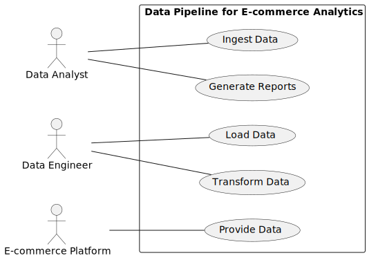
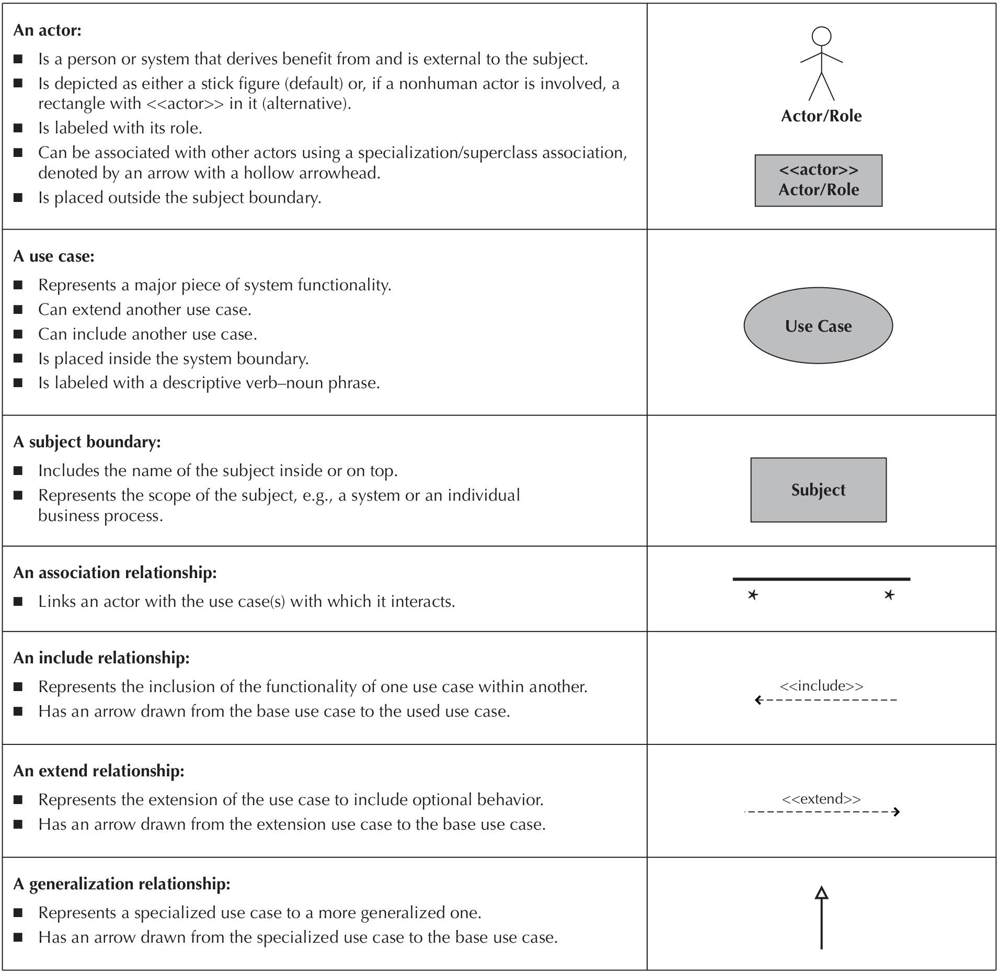
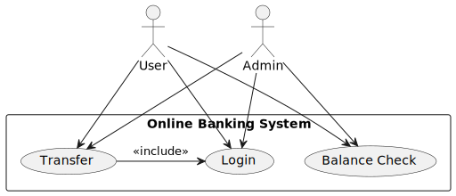

# Software Modeling Techniques

In the realm of software engineering, adeptness in modeling techniques is paramount for crafting robust and scalable systems. This exploration delves into various facets of software modeling, encompassing object modeling, dynamic modeling, function modeling, and the comparative analysis of structured and object-oriented approaches. These methodologies collectively empower developers to architect solutions that are not only functionally comprehensive but also adaptable to evolving business needs.

## Object Modeling

Object modeling serves as the cornerstone of software design by encapsulating real-world entities as objects, each characterized by attributes and behaviors. This technique enables developers to conceptualize and represent complex systems in a structured manner. For instance, in a healthcare management application, objects such as `Patient`, `Doctor`, and `Appointment` are modeled with attributes (e.g., patient ID, doctor name) and behaviors (e.g., schedule appointment, update medical records).

## Dynamic Modeling

Dynamic modeling focuses on capturing the behavioral aspects of software systems, illustrating how objects interact and respond to events over time. By employing tools like sequence diagrams and state diagrams, developers can visualize the flow of actions and transitions within a system. For example, in an e-commerce platform, dynamic modeling elucidates the sequence of events from a customer adding items to a shopping cart to completing a purchase, ensuring a seamless user experience.

## Function Modeling

Function modeling delineates the functional aspects of a system by defining the operations performed by its components. This technique emphasizes what the system does to achieve its objectives. Use case diagrams and data flow diagrams are instrumental in depicting the interactions between users (actors) and the system. For instance, in a banking application, function modeling outlines operations such as account management, funds transfer, and transaction reporting, elucidating the system's functionalities.

## Structured Analysis and Object-Oriented Analysis

Structured analysis and object-oriented analysis (OOA) are pivotal methodologies for dissecting system requirements and designing software solutions.

- **Structured Analysis**: This methodology breaks down a system into discrete components and their interactions using tools like data flow diagrams (DFDs) and entity-relationship diagrams (ERDs). It facilitates a hierarchical understanding of data flow and process decomposition, making it suitable for systematic analysis of complex systems.

- **Object-Oriented Analysis (OOA)**: OOA revolves around modeling systems as collections of interacting objects, each encapsulating data and behaviors. With techniques such as class diagrams and use case diagrams, OOA promotes modularity, reusability, and adaptability in software design. This approach is particularly effective for agile development environments and systems requiring iterative enhancements.

# Object-Oriented Analysis (OOA)

Object-oriented analysis (OOA) is a methodology used in software engineering to analyze and model real-world systems based on the principles of object-oriented programming (OOP). It focuses on identifying and defining the objects, their attributes, behaviors, and relationships to model a system accurately. Let's explore OOA through a real-world example: an online shopping system.

## Understanding Objects in OOA

In the context of an online shopping system, objects represent tangible entities or concepts within the system. These could include `Customer`, `Product`, `Order`, `ShoppingCart`, `Payment`, and `ShippingAddress`. Each object has specific attributes that describe its characteristics and behaviors that define how it interacts with other objects.

- **Customer**: Attributes could include `customerId`, `name`, `email`, and behaviors like `register()`, `login()`, `placeOrder()`.
- **Product**: Attributes could include `productId`, `name`, `description`, `price`, and behaviors like `displayDetails()`, `addToCart()`.
- **Order**: Attributes could include `orderId`, `orderDate`, `totalAmount`, and behaviors like `addItem()`, `calculateTotal()`.
- **ShoppingCart**: Attributes could include `cartId`, `items`, `totalPrice`, and behaviors like `addItem()`, `removeItem()`, `checkout()`.

## Relationships and Interactions

OOA also emphasizes modeling relationships and interactions between objects:

- **Association**: Defines relationships between objects. For example, a `Customer` places an `Order`, creating an association between the two.
- **Aggregation**: Represents a whole-part relationship where one object (whole) contains other objects (parts). For instance, an `Order` contains `OrderItem`s.
- **Inheritance**: Allows objects to inherit attributes and behaviors from parent classes. In our example, different types of customers (`RegularCustomer`, `PremiumCustomer`) could inherit from a `Customer` class.

## Example Scenario: Placing an Order

1. **Object Identification**: Identify key objects involved in placing an order—`Customer`, `Product`, `Order`, and `ShoppingCart`.

2. **Attributes and Behaviors**: Define attributes (data) and behaviors (methods) for each object. For example:
   
   - `Customer`: Attributes - `customerId`, `name`, `email`; Behaviors - `login()`, `placeOrder()`.
   - `Product`: Attributes - `productId`, `name`, `price`; Behaviors - `displayDetails()`, `addToCart()`.
   - `Order`: Attributes - `orderId`, `orderDate`, `totalAmount`; Behaviors - `addItem()`, `calculateTotal()`.
   - `ShoppingCart`: Attributes - `cartId`, `items`, `totalPrice`; Behaviors - `addItem()`, `removeItem()`, `checkout()`.

3. **Relationships**: Establish relationships between objects. For example, a `Customer` places an `Order`, and an `Order` contains `OrderItem`s representing products.

4. **Behavioral Modeling**: Define how objects interact to achieve system functionality. For instance, a `Customer` adds items to a `ShoppingCart`, reviews them, and then places an `Order`.

## Identifying and Modeling Objects and Relationships

Analyzing a problem to detect and select objects, and determining their relationships in object-oriented analysis (OOA), involves a systematic approach to understanding the requirements of a system and translating them into a structured model. Here’s a step-by-step guide on how to analyze a problem in OOA:

1. **Understand the Problem Domain**
   
   - Gather requirements from stakeholders and domain experts.
   - Define the scope and objectives of the system to be developed.

2. **Identify Objects**
   
   - Recognize tangible entities and conceptual elements within the problem domain.
   - Specify attributes (properties) for each object that describe its state.
   - Determine behaviors (methods) that define how objects interact and operate.

3. **Establish Relationships Between Objects**
   
   - Identify associations that connect objects based on interactions or dependencies.
   - Model aggregations/compositions where one object contains or is composed of others.
   - Utilize inheritance to promote code reuse and establish hierarchical relationships.

4. **Define Object Interaction and Behavior**
   
   - Specify how objects collaborate to achieve system functionality.
   - Define use cases and scenarios to describe interactions between objects for specific tasks.
   - Create sequence diagrams or collaboration diagrams to illustrate object interactions.

5. **Refine and Validate the Object Model**
   
   - Validate the object model against system requirements and use cases.
   - Ensure that the object model accurately represents the problem domain and meets functional requirements.
   - Iterate on the model based on feedback, ensuring clarity, completeness, and consistency.

6. **Document the Object-Oriented Model**
   
   - Document the finalized object model using standard modeling techniques (UML diagrams).
   - Include class diagrams, sequence diagrams, and any necessary documentation to communicate the design.

7. **Prepare for Object-Oriented Design (OOD)**
   
   - Transition from analysis to design by mapping the object model to implementation details.
   - Identify patterns and frameworks that can be leveraged during the design phase.
   - Ensure that the object model provides a solid foundation for the subsequent development phases.

| Step                                        | Description                                                                                                    | Activities                                                                                                                |
| ------------------------------------------- | -------------------------------------------------------------------------------------------------------------- | ------------------------------------------------------------------------------------------------------------------------- |
| 1. Understand the Problem Domain            | Start by understanding and defining the problem domain.                                                        | - Gather requirements - Define scope and objectives                                                                    |
| 2. Identify Objects                         | Identify objects within the domain and specify their attributes and behaviors.                                 | - Recognize entities and concepts - Specify attributes and behaviors                                                   |
| 3. Establish Relationships Between Objects  | Define relationships such as associations, aggregations/compositions, and inheritance.                         | - Identify associations - Model aggregations/compositions - Utilize inheritance                                     |
| 4. Define Object Interaction and Behavior   | Specify how objects interact and behave to achieve system functionality.                                       | - Specify collaborations - Define use cases and scenarios - Create sequence/collaboration diagrams                  |
| 5. Refine and Validate the Object Model     | Ensure the object model meets requirements and is refined based on feedback.                                   | - Validate against requirements - Iterate based on feedback - Ensure clarity, completeness, consistency             |
| 6. Document the Object-Oriented Model       | Document the finalized object model using UML diagrams and detailed documentation.                             | - Use UML diagrams - Class diagrams, sequence diagrams, etc. - Detailed documentation                               |
| 7. Prepare for Object-Oriented Design (OOD) | Prepare for transitioning from analysis to design, mapping to implementation details and identifying patterns. | - Map model to implementation details - Identify patterns and frameworks - Ensure foundation for development phases |

### Benefits of Object-Oriented Analysis (OOA):

- **Clarity and Precision**: Provides a clear and structured approach to modeling complex systems.
- **Modularity and Reusability**: Promotes modular design, facilitating code reuse and maintenance.
- **Scalability and Flexibility**: Supports iterative development and accommodates changes in system requirements.

In conclusion, object-oriented analysis provides a systematic approach to model and understand complex systems by focusing on objects, their attributes, behaviors, and interactions. Applying OOA principles to real-world examples, such as an online shopping system, helps developers and analysts create robust and adaptable software solutions that meet user needs effectively.

---

## Exmple 1: Online Bookstore

**Scenario**: You are tasked with developing an online bookstore where users can browse, search, and purchase books. The system should manage book inventory, user accounts, and orders. The bookstore will also feature book reviews and ratings.

### 1. Understand the Problem Domain

**Objective**: Start by understanding and defining the problem domain.

**Activities**:

- Gather requirements from stakeholders (e.g., bookstore owners, potential users).
- Define the scope and objectives of the online bookstore.

**Example**: 

Requirements:

- Users should be able to search for books by title, author, genre, and ISBN.
- Users should be able to create accounts, log in, and manage their profiles.
- Users should be able to add books to a shopping cart and place orders.
- The system should handle book inventory management.
- Users should be able to write reviews and rate books.

### 2. Identify Objects

**Objective**: Identify objects within the domain and specify their attributes and behaviors.

**Activities**:

- Recognize entities and concepts such as Book, User, ShoppingCart, Order, Review.
- Specify attributes (e.g., Book: title, author, price; User: name, email) and behaviors (methods/functions).

**Example**:

Objects:

- **Book**: title, author, ISBN, price, stockQuantity
- **User**: name, email, password, address
- **ShoppingCart**: items, totalPrice
- **Order**: orderID, user, orderDate, orderStatus
- **Review**: rating, comment, user, book

### 3. Establish Relationships Between Objects

**Objective**: Define relationships such as associations, aggregations/compositions, and inheritance.

**Activities**:

- Identify associations (e.g., a User can write multiple Reviews).
- Model aggregations/compositions (e.g., a ShoppingCart contains multiple Book items).
- Utilize inheritance if applicable (e.g., specialized user types like AdminUser).

**Example**:

Relationships:

- A **User** can have multiple **Orders**.
- A **Book** can have multiple **Reviews**.
- A **ShoppingCart** contains multiple **Books**.
- An **Order** is associated with a **User** and contains multiple **Books**.

### 4. Define Object Interaction and Behavior

**Objective**: Specify how objects interact and behave to achieve system functionality.

**Activities**:

- Specify collaborations between objects (e.g., User adds Book to ShoppingCart).
- Define use cases and scenarios (e.g., checkout process).
- Create sequence/collaboration diagrams to visualize interactions.

**Example**:

Use Case: Checkout Process

- **Scenario**: User selects books, adds them to the shopping cart, and places an order.
- **Interactions**:
  1. User searches for books.
  2. User adds selected books to the shopping cart.
  3. User views the shopping cart and proceeds to checkout.
  4. System creates an Order and updates the inventory.

### 5. Refine and Validate the Object Model

**Objective**: Ensure the object model meets requirements and is refined based on feedback.

**Activities**:

- Validate the object model against the requirements.
- Iterate based on feedback from stakeholders.
- Ensure clarity, completeness, and consistency of the model.

**Example**:

Validation:

- Check if all user stories (requirements) are covered by the object model.
- Ensure no missing relationships or attributes.
- Get feedback from stakeholders (e.g., bookstore owner) and refine the model accordingly.

### 6. Document the Object-Oriented Model

**Objective**: Document the finalized object model using UML diagrams and detailed documentation.

**Activities**:

- Use UML diagrams to document the object model.
- Create class diagrams, sequence diagrams, and use case diagrams.
- Provide detailed documentation for each object and interaction.

**Example**:

Documentation:

- **Class Diagram**: Shows classes (Book, User, Order, etc.) and their relationships.
- **Sequence Diagram**: Illustrates the checkout process.
- **Use Case Diagram**: Visualizes user interactions with the system.

---

## Example 2: Data Pipeline for E-commerce Analytics

**Scenario**: You are tasked with developing a data pipeline for an e-commerce platform. The pipeline will ingest data from various sources, transform it, and load it into a data warehouse for analytics. The system should handle data ingestion, processing, and storage, as well as support reporting and visualization.

### 1. Understand the Problem Domain

**Objective**: Start by understanding and defining the problem domain.

**Activities**:

- Gather requirements from stakeholders (e.g., data analysts, business managers).
- Define the scope and objectives of the data pipeline.

**Example**: 

Requirements:

- The system should ingest data from various sources (e.g., transaction logs, user activity, inventory).
- The system should clean and transform the data for analysis.
- The system should load the processed data into a data warehouse.
- The system should support data visualization and reporting.
- The system should ensure data quality and handle errors gracefully.

### 2. Identify Objects

**Objective**: Identify objects within the domain and specify their attributes and behaviors.

**Activities**:

- Recognize entities and concepts such as DataSource, DataPipeline, DataTransformer, DataWarehouse, Report.
- Specify attributes (e.g., DataSource: sourceType, connectionDetails; DataTransformer: transformationRules) and behaviors (methods/functions).

**Example**:

Objects:

- **DataSource**: sourceType, connectionDetails, fetchData()
- **DataPipeline**: dataSources, transformers, runPipeline()
- **DataTransformer**: transformationRules, transformData()
- **DataWarehouse**: schema, loadData()
- **Report**: reportType, generateReport()

### 3. Establish Relationships Between Objects

**Objective**: Define relationships such as associations, aggregations/compositions, and inheritance.

**Activities**:

- Identify associations (e.g., a DataPipeline has multiple DataSources).
- Model aggregations/compositions (e.g., a DataTransformer is part of a DataPipeline).
- Utilize inheritance if applicable (e.g., specialized transformer types like AggregationTransformer, FilteringTransformer).

**Example**:

Relationships:

- A **DataPipeline** can have multiple **DataSources**.
- A **DataPipeline** uses multiple **DataTransformers**.
- A **DataWarehouse** is the target for the **DataPipeline**.
- A **Report** is generated from the **DataWarehouse**.

### 4. Define Object Interaction and Behavior

**Objective**: Specify how objects interact and behave to achieve system functionality.

Activities:

- Specify collaborations between objects (e.g., DataPipeline fetches data from DataSource and passes it to DataTransformer).
- Define use cases and scenarios (e.g., running the data pipeline).
- Create sequence/collaboration diagrams to visualize interactions.

**Example**:

Use Case: Running the Data Pipeline

- **Scenario**: The DataPipeline fetches data from multiple DataSources, applies transformations, and loads the data into the DataWarehouse.
- **Interactions**:
  1. DataPipeline fetches raw data from DataSources.
  2. DataPipeline applies transformations using DataTransformers.
  3. DataPipeline loads transformed data into the DataWarehouse.
  4. DataWarehouse stores the data for reporting and analysis.

### 5. Refine and Validate the Object Model

**Objective**: Ensure the object model meets requirements and is refined based on feedback.

**Activities**:

- Validate the object model against the requirements.
- Iterate based on feedback from stakeholders.
- Ensure clarity, completeness, and consistency of the model.

**Example**:

Validation:

- Check if all user stories (requirements) are covered by the object model.
- Ensure no missing relationships or attributes.
- Get feedback from stakeholders (e.g., data analysts) and refine the model accordingly.

### 6. Document the Object-Oriented Model

**Objective**: Document the finalized object model using UML diagrams and detailed documentation.

**Activities**:

- Use UML diagrams to document the object model.
- Create class diagrams, sequence diagrams, and use case diagrams.
- Provide detailed documentation for each object and interaction.

**Example**:

Documentation:

- **Class Diagram**: Shows classes (DataSource, DataPipeline, DataTransformer, etc.) and their relationships.
- **Sequence Diagram**: Illustrates the data pipeline process.
- **Use Case Diagram**: Visualizes user interactions with the system.

### 7. Prepare for Object-Oriented Design (OOD)

**Objective**: Prepare for transitioning from analysis to design, mapping to implementation details and identifying patterns.

**Activities**:

- Map the conceptual model to implementation details (e.g., database schema).
- Identify patterns and frameworks to be used (e.g., ETL tools, Apache Kafka for streaming data).
- Ensure a solid foundation for the subsequent development phases.

**Example**:

Preparation:

- Design database schema based on object model (tables for raw data, transformed data, etc.).
- Choose frameworks and tools for implementation (e.g., Apache Airflow for orchestrating the pipeline).
- Plan for code structure and design patterns to be used in development.

---

# Optional Reading Topics:

## UML Diagrams

Unified Modeling Language (UML) diagrams are crucial tools in software development, providing a standardized way to visualize the design and structure of a system. These diagrams serve various purposes throughout the software development lifecycle, from analysis and design to implementation and physical design. By understanding the primary phases in which different UML diagrams are used, developers and analysts can effectively communicate complex system architectures and behaviors, facilitating better planning, design, and execution of software projects.

### UML Diagrams in Different Phases of Software Development

#### Structure Diagrams

Structure diagrams in UML are used to represent the static aspects of a system. They focus on the organization and arrangement of the different parts of a system, showing how these parts interact and how they are structured. These diagrams are essential for understanding the architecture and components of the system, as well as their relationships.

| Diagram Name        | Used to...                                                                                                                                      | Primary Phase                    |
| ------------------- | ----------------------------------------------------------------------------------------------------------------------------------------------- | -------------------------------- |
| Class               | Illustrate the relationships between classes modeled in the system                                                                              | Analysis, Design                 |
| Object              | Illustrate the relationships between objects modeled in the system; used when actual instances of the classes will better communicate the model | Analysis, Design                 |
| Package             | Group other UML elements together to form higher-level constructs                                                                               | Analysis, Design, Implementation |
| Deployment          | Show the physical architecture of the system; can also be used to show software components being deployed onto the physical architecture        | Physical Design, Implementation  |
| Component           | Illustrate the physical relationships among the software components                                                                             | Physical Design, Implementation  |
| Composite Structure | Illustrate the internal structure of a class, i.e., the relationships among the parts of a class                                                | Analysis, Design                 |
| Profile             | Used to develop extensions to the UML itself                                                                                                    | Structure Diagrams               |

#### Behavioral Diagrams

Behavioral diagrams in UML are used to model the dynamic aspects of a system. They capture the interactions between objects and the changes in the system's state over time. These diagrams are crucial for understanding how the system behaves in different scenarios, how processes flow, and how objects interact within the system.

| Diagram Name             | Used to...                                                                                                                      | Primary Phase    |
| ------------------------ | ------------------------------------------------------------------------------------------------------------------------------- | ---------------- |
| Activity                 | Illustrate business workflows independent of classes, the flow of activities in a use case, or detailed design of a method      | Analysis, Design |
| Sequence                 | Model the behavior of objects within a use case; focuses on the time-based ordering of an activity                              | Analysis, Design |
| Communication            | Model the behavior of objects within a use case; focus on the communication among a set of collaborating objects of an activity | Analysis, Design |
| Interaction Overview     | Illustrate an overview of the flow of control of a process                                                                      | Analysis, Design |
| Timing                   | Illustrate the interaction among a set of objects and the state changes they go through along a time axis                       | Analysis, Design |
| Behavioral State Machine | Examine the behavior of one class                                                                                               | Analysis, Design |
| Protocol State Machine   | Illustrate the dependencies among the different interfaces of a class                                                           | Analysis, Design |
| Use-Case                 | Capture business requirements for the system and illustrate the interaction between the system and its environment              | Analysis         |

**Reference:** Systems Analysis and Design: An Object-Oriented Approach with UML, by: Alan Dennis, Barbara Wixom, David Tegarden

### Use Case Diagram

A use case diagram is a type of UML diagram used to capture the functional requirements of a system. It illustrates the interactions between users (actors) and the system, representing the various ways the system can be used to achieve specific goals (use cases).

**Components:**

1. **Actors:**
   
   - Represent entities that interact with the system (e.g., users, other systems).
   - Depicted as stick figures.

2. **Use Cases:**
   
   - Describe specific functionalities or goals the system can achieve.
   - Represented as ovals.

3. **System Boundary:**
   
   - Defines the scope of the system.
   - Represented as a rectangle enclosing use cases.

4. **Relationships:**
   
   - **Associations:** Lines connecting actors to use cases, indicating interaction.
   - **Include:** Dotted arrows with "<<include>>" keyword, showing mandatory use case inclusion.
   - **Extend:** Dotted arrows with "<<extend>>" keyword, representing optional or conditional use cases.
   - **Generalization:** Solid arrows with hollow triangle heads, depicting inheritance between actors or use cases.

#### Example Use Case Diagram:

In this use case diagram for an online banking system, two actors, User and Admin, interact with the system to perform various actions. The system includes three main use cases: Login, Transfer, and Balance Check. The diagram shows that both User and Admin can perform all these actions, with the use case Transfer requiring the user to be logged in first, indicated by the include relationship between Transfer and Login.

This use case diagram captures the primary functionalities of an online banking system, focusing on the interactions between different types of users and the system itself. The actors, User and Admin, represent the entities interacting with the system. Both actors can log in, transfer money, and check their account balance. The Login use case is fundamental, as it is a prerequisite for performing transfers, demonstrated by the include relationship. This relationship ensures that the system first verifies the user's credentials before allowing them to proceed with money transfers, enhancing security and ensuring proper user authentication within the system. The diagram provides a clear and concise representation of the system's functional requirements, facilitating communication among stakeholders and aiding in the system's design and implementation phases.

In this diagram:

- **Actors:** User and Admin.
- **Use Cases:** Login, Transfer, Balance Check.
- **System Boundary:** Online Banking System.
- **Relationships:**
  - Association between User and Login.
  - Include relationship between Transfer and Login.
  - Generalization relationship between User and Admin (if Admin inherits the functionalities of User).

