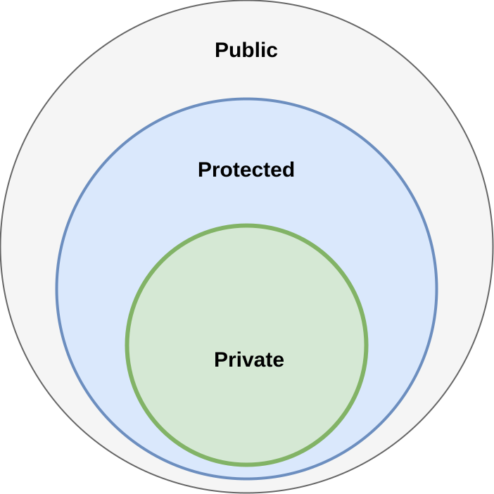
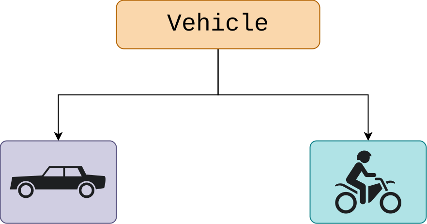
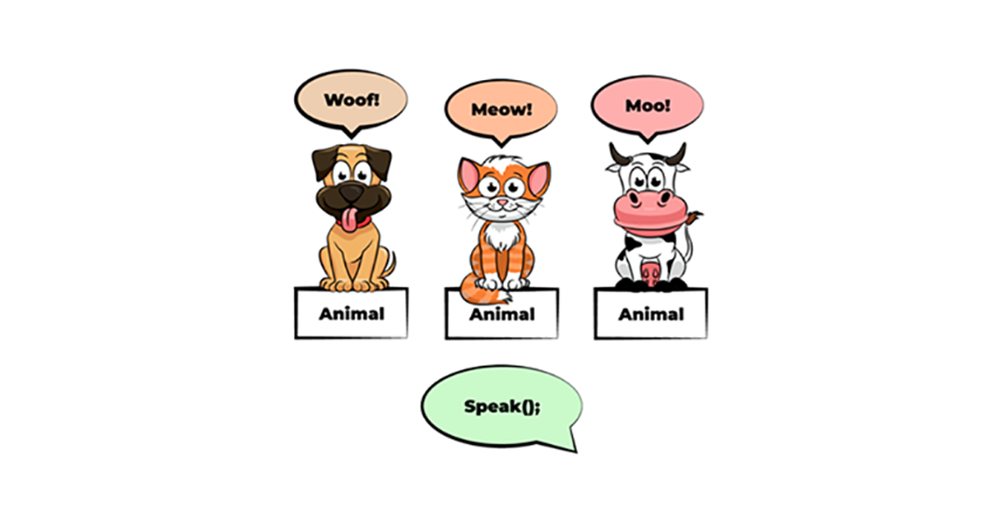

# Object-Oriented Design (OOD)

Object-Oriented Design (OOD) is a methodology in software engineering that uses the principles of object-oriented programming (OOP) to create a structured and modular software system. The core idea behind OOD is to design a system as a collection of interacting objects, each representing real-world entities or concepts, which encapsulate both data and behavior. OOD emphasizes the creation of a blueprint for software that defines the types of objects, their relationships, and how they interact to fulfill the requirements of the system.

In OOD, the design process focuses on identifying and defining classes and objects, their attributes, and the interactions among them. It transforms abstract requirements into a detailed design specification that can guide the implementation of the system. This approach contrasts with procedural programming, which organizes code around functions and procedures rather than data and objects.

**Key Differences Between OOD and OOA**

Object-Oriented Analysis (OOA) and Object-Oriented Design (OOD) are complementary phases in the software development lifecycle, but they serve different purposes:

- **Object-Oriented Analysis (OOA):** This phase focuses on understanding and modeling the problem domain. It involves identifying the key objects, their attributes, and their interactions within the context of the problem being solved. The goal of OOA is to create a conceptual model of the system that captures the essential requirements and relationships among objects.

- **Object-Oriented Design (OOD):** In contrast, OOD takes the conceptual model from OOA and refines it into a detailed design that specifies how the system will be built. This includes designing the architecture of the system, defining classes and their relationships, and specifying how objects will collaborate to achieve the system’s goals. OOD emphasizes the implementation details and how the design will be translated into code.

**Importance of OOD in Software Engineering**

Object-Oriented Design plays a crucial role in modern software engineering for several reasons:

1. **Modularity:** OOD promotes modular design by encapsulating data and behavior within objects. This modularity facilitates code reusability and maintainability, as changes to one part of the system can be made with minimal impact on other parts.

2. **Scalability:** By organizing software into objects and classes, OOD allows for the creation of scalable systems. New functionalities can be added by introducing new classes or extending existing ones without altering the entire system.

3. **Abstraction and Encapsulation:** OOD leverages abstraction to simplify complex systems by focusing on essential aspects while hiding unnecessary details. Encapsulation ensures that the internal state of objects is protected and only accessible through well-defined interfaces, enhancing security and reliability.

4. **Reuse and Extensibility:** OOD supports inheritance, enabling the creation of new classes based on existing ones. This promotes code reuse and makes it easier to extend the system with new features.

5. **Design Patterns:** OOD encourages the use of design patterns, which are proven solutions to common design problems. Patterns provide best practices and reusable solutions that improve the quality and efficiency of software design.

# Core Concepts of OOD

Object-Oriented Design (OOD) is underpinned by several core concepts that shape how systems are designed and implemented. These concepts provide the foundation for creating modular, reusable, and maintainable software systems. Understanding these core concepts is crucial for effectively applying OOD principles. Here are the essential concepts:

## 1. Classes

Class is a blueprint for creating objects. It defines a type of object by specifying its attributes (data members) and methods (functions). In OOD, classes are used to encapsulate data and behavior into a single unit. Each class can be thought of as a template that describes the properties and capabilities of a group of objects.

- **Attributes:** These are the data members of a class that represent the state of an object. Attributes define what kind of information an object holds.
- **Methods:** These are the functions defined within a class that operate on the attributes. Methods define the behavior of objects.

Classes organize and encapsulate data and methods that operate on that data. They promote reusability and maintainability by allowing the creation of multiple objects with similar attributes and behavior from a single class definition.

## 2. Objects

An object is an instance of a class that encapsulates both state (attributes) and behavior (methods). Objects represent entities in the real world or within a software system, and they interact with other objects to perform tasks and solve problems. Objects serve as the fundamental building blocks in OOD. They model real-world entities or concepts and allow for the abstraction of complex systems into manageable units. Objects can interact with one another to fulfill the requirements of the system.

### Examples and Attributes:

- In a banking system, objects might include `Account`, `Customer`, and `Transaction`.
- In an e-commerce application, objects could be `Product`, `Order`, and `Customer`.

Attributes are the data fields within an object that represent its state. For example:

- A `Customer` object might have attributes like `customerID`, `name`, `email`, and `address`.
- An `Order` object could have attributes such as `orderID`, `orderDate`, `totalAmount`, and `status`.

## Relationship Between Classes and Objects:

- Relationship:
  - **Classes:** Serve as templates or blueprints.
  - **Objects:** Are instances created from these blueprints. Each object has its own distinct state but shares the same structure and behavior as defined by its class.
- Example:
  - A `Vehicle` class might define attributes like `make`, `model`, and `year`, along with methods like `start()` and `stop()`. Each specific car (e.g., a `Toyota Corolla` or `Honda Civic`) is an object created from the `Vehicle` class.

## Designing Effective Classes:

- **Encapsulation:** Ensure that classes encapsulate data and provide methods to manipulate that data. This hides the internal implementation details and protects the integrity of the data.
- **Cohesion:** Design classes to have high cohesion, meaning that the class should represent a single concept or responsibility. All attributes and methods should be closely related to that concept.
- **Modularity:** Create classes that can be easily reused and maintained. This involves defining clear interfaces and avoiding tight coupling between classes.
- **Abstraction:** Use abstraction to define classes that represent general concepts while hiding the complex details from the user.

## 3. Messages

In OOD, a message is a communication mechanism used by objects to interact with one another. When an object needs to invoke a method on another object, it sends a message to that object, specifying the method and any necessary parameters. The purpose of messaging is to facilitate communication and coordination between objects. It allows objects to request services or information from other objects and to collaborate in achieving the system’s goals.

### Mechanisms for Message Passing:

#### Method Calls:

 In most object-oriented languages, message passing is implemented through method calls. An object sends a message to another object by invoking one of its methods.

- **Example:** An `Order` object might send a message to a `Customer` object to retrieve the customer’s shipping address.

#### Event Handling:

Some object-oriented systems use events to handle message passing. Objects can listen for and respond to events triggered by other objects.

- **Example:** In a GUI application, a `Button` object might send a click event to a `Handler` object that processes the event and updates the user interface.

#### Asynchronous Messaging:

For systems that support concurrency, asynchronous messaging allows objects to send messages without waiting for a response, enabling parallel processing.

- **Example:** An `Order` object might send an asynchronous message to a `PaymentProcessor` object to handle payment authorization, allowing the `Order` object to continue processing other tasks.

# Fundamental Principles of OOD

## Abstraction

**Concept of Abstraction in Design:**

Abstraction is a fundamental principle in object-oriented design that involves simplifying complex systems by focusing on the essential characteristics while hiding the irrelevant details. It allows designers to model real-world entities and their interactions without needing to delve into the specifics of their implementations.

The goal of abstraction is to reduce complexity by breaking down a system into simpler, more manageable components. By abstracting away unnecessary details, designers can create models that are easier to understand and work with, allowing for more effective design and maintenance.

#### Implementation Techniques:

- **Use of Classes:** Classes are the primary mechanism for implementing abstraction. A class provides a blueprint that defines the structure (attributes) and behavior (methods) of objects. By using classes, designers can encapsulate complex functionality into manageable units and create objects that interact with each other through well-defined interfaces.
  - **Example:** In a banking application, an `Account` class abstracts the details of account management, such as balance calculation and transaction processing, allowing users to interact with `Account` objects without knowing the underlying implementation details.
- **Abstract Classes and Interfaces:** These are used to define common behaviors and properties for a group of related classes. Abstract classes can provide a partial implementation and require subclasses to complete the details, while interfaces define a contract that implementing classes must follow.
  - **Example:** An `Account` class might define abstract methods like `deposit()` and `withdraw()`, which are implemented by concrete subclasses such as `SavingsAccount` and `CheckingAccount`.

## Encapsulation

**Definition and Significance:**

Encapsulation is the principle of bundling the data (attributes) and methods (functions) that operate on the data into a single unit, known as a class. It involves hiding the internal state of an object and requiring all interactions to be performed through its methods. Encapsulation is crucial for maintaining the integrity of an object’s state and for controlling how its data is accessed and modified. It provides a clear separation between an object’s internal implementation and its external interface, which helps in reducing system complexity and enhancing security.

### How Encapsulation Protects Data:

- **Access Control:** By using access specifiers (e.g., `private`, `protected`, `public`), encapsulation restricts direct access to an object’s internal data. This prevents external code from modifying the data in an unintended or harmful way.
  
  - **Example:** An `Account` class might have a `private` attribute `balance` and provide `public` methods like `deposit()` and `withdraw()` to safely manipulate the balance.
  
  

- **Data Hiding:** Encapsulation allows objects to hide their internal state from the outside world. This means that changes to the internal representation of the data do not affect other parts of the system, as long as the public interface remains consistent.
  - **Example:** If the `Account` class changes how it calculates interest, it can do so without affecting the code that uses `Account` objects, as long as the public methods for depositing and withdrawing funds remain unchanged.

## Inheritance

**Hierarchical Relationships and Reusability:**

Inheritance is a principle that allows a new class to inherit attributes and methods from an existing class. This creates a hierarchical relationship between classes, where the new class (subclass or derived class) inherits characteristics from an existing class (superclass or base class). Inheritance promotes reusability by allowing designers to build upon existing classes rather than creating new classes from scratch. It enables the creation of specialized classes that reuse common functionality while extending or modifying specific aspects.

- **Example:** A `Vehicle` class might serve as a superclass with general attributes like `make` and `model`, while subclasses like `Car` and `Bike` inherit these attributes and add their specific features, such as `numberOfDoors` for `Car`.

### Designing Class Hierarchies:

Designing effective class hierarchies involves defining a clear relationship between base and derived classes. Base classes should encapsulate common functionality, while derived classes should extend or specialize this functionality.

- **Example:** A class hierarchy for a zoo management system might include a `Mammal` base class with attributes like `species` and `age`, and derived classes such as `Lion` and `Elephant` that add specific attributes and behaviors.

## Polymorphism

Polymorphism is the principle that allows objects of different classes to be treated as objects of a common superclass. It enables a single interface to be used for different underlying forms (data types), allowing for flexibility in code.

### Implementation Techniques:

- **Method Overloading:** Allows multiple methods with the same name but different parameters to exist within a class. This provides a way to perform similar operations with different types of input.
  - **Example:** A `print()` method in a `Printer` class might be overloaded to handle different types of documents, such as text files and image files.
- **Method Overriding:** Allows a subclass to provide a specific implementation of a method that is already defined in its superclass. This enables subclasses to customize or extend the behavior of inherited methods.
  - **Example:** A `Shape` class might define a method `draw()`, which is overridden by subclasses like `Circle` and `Square` to provide specific drawing logic for each shape.

### Benefits of Polymorphism in Design:

- **Flexibility:** Polymorphism allows for code that can handle objects of different types through a common interface. This flexibility simplifies code maintenance and enhances its ability to accommodate future changes.
  
  - **Example:** A function that processes different types of shapes can work with any shape object, whether it’s a `Circle` or `Square`, without needing to know the specific class of the shape.
  
- **Extensibility:** By leveraging polymorphism, new classes can be added to a system with minimal changes to existing code. This supports the addition of new features or behaviors without altering the core functionality.
  - **Example:** Adding a new `Triangle` class to a graphics application would require minimal changes to existing code that processes shapes, thanks to polymorphism.
  
  

# Stages of Object-Oriented Design (OOD)

### System Design

#### Designing the Overall Architecture:

System design is the process of defining the architecture of a software system, including its components and their interactions. It involves creating a high-level model that outlines how the system will be structured and how different parts will work together to achieve the desired functionality.

The goal of system design is to establish a solid foundation for building the software by organizing and structuring the system in a way that promotes efficiency, scalability, and maintainability.

**Activities:**

- **Identifying Components:** Determine the major components or modules of the system based on functional requirements. Each component should encapsulate a specific set of responsibilities.
  - **Example:** In an e-commerce application, components might include user management, product catalog, order processing, and payment processing.
- **Defining Interfaces:** Specify the interfaces through which components will interact with each other. This involves defining the methods and data exchanged between components.
  - **Example:** The user management component might provide an interface for authentication, which is used by the order processing component to verify user identity.

#### Creating Subsystems and Their Interactions:

Subsystems are groups of related components that work together to perform a set of related functions. Creating subsystems involves organizing components into cohesive units that handle specific aspects of the system’s functionality.

Subsystems help manage complexity by grouping related components and defining clear boundaries for interaction. They support modularity and can be developed and tested independently.

**Activities:**

- **Defining Subsystem Boundaries:** Determine the boundaries of each subsystem and the responsibilities it will handle. This involves identifying the inputs and outputs of each subsystem.
  - **Example:** In a library management system, a catalog subsystem might handle book searches and catalog management, while a circulation subsystem manages book checkouts and returns.
- **Establishing Communication:** Define how subsystems will communicate with each other, including the protocols and data formats used for interaction.
  - **Example:** A message-based communication approach might be used, where subsystems send and receive messages using a common messaging format.

### Object Design

#### Detailing the Design of Individual Classes:

Object design involves specifying the details of individual classes, including their attributes, methods, and interactions. This stage translates the high-level system design into a concrete implementation plan.

The goal of object design is to define how each class will be implemented to fulfill its role within the system. It involves refining the class structures and ensuring that they align with the overall system design.

**Activities:**

- **Defining Class Attributes and Methods:** Specify the attributes (data) and methods (functions) for each class. Ensure that each class has the necessary functionality to perform its role.
  - **Example:** A `User` class might have attributes like `username` and `password`, and methods like `authenticate()` and `updateProfile()`.
- **Designing Class Interactions:** Determine how classes will interact with each other, including the methods they will call and the data they will exchange.
  - **Example:** A `ShoppingCart` class might interact with a `Product` class to add items to the cart and calculate totals.

#### Establishing Relationships and Responsibilities:

This involves defining the relationships between classes, such as inheritance and associations, and specifying the responsibilities of each class within the system.

Establishing clear relationships and responsibilities ensures that the system’s design is coherent and that each class fulfills its intended role without overlapping responsibilities.

**Activities:**

- **Defining Relationships:** Specify how classes are related, including inheritance (is-a relationships) and associations (has-a relationships).
  - **Example:** A `Customer` class might inherit from a `Person` class, while a `ShoppingCart` class might have an association with a `Product` class.
- **Assigning Responsibilities:** Ensure that each class has a well-defined responsibility and that responsibilities are distributed appropriately across the classes.
  - **Example:** The `Order` class might be responsible for managing order details, while the `Payment` class handles payment processing.

# Key Processes in Object-Oriented Design (OOD)

### Object-Oriented Decomposition

Object-oriented decomposition is the process of breaking down a complex system into smaller, manageable objects or components. This technique simplifies the system by dividing it into more understandable and manageable pieces, each of which handles a specific aspect of the system’s functionality.

The main goal of decomposition is to reduce complexity, improve maintainability, and enhance the clarity of the system's design. By focusing on smaller, well-defined objects, developers can manage complexity more effectively.

**Benefits:**

- **Simplifies Complex Systems:** Decomposition makes it easier to understand and manage large systems by breaking them into smaller, more manageable parts.
  - **Example:** In a banking application, decomposing the system into objects like `Account`, `Transaction`, and `Customer` allows developers to focus on each object’s specific functionality.
- **Encourages Reusability:** Smaller objects can often be reused in different parts of the system or in other projects.
  - **Example:** A `PaymentProcessor` object could be reused in various financial applications.
- **Facilitates Testing and Debugging:** Isolated objects can be tested and debugged independently, leading to more efficient development and troubleshooting.
  - **Example:** Testing the `Order` object separately from the `Inventory` object can help identify and fix issues more quickly.

#### Techniques for Decomposing Complex Systems:

- **Identify High-Level Components:** Begin by identifying the major components or subsystems of the system based on its functional requirements.
  - **Example:** For a customer management system, high-level components might include `Customer`, `Order`, and `Product`.
- **Define Object Responsibilities:** Determine the responsibilities of each object and ensure that each object handles a specific aspect of the system's functionality.
  - **Example:** The `Customer` object might handle customer data and interactions, while the `Order` object manages order processing.
- **Establish Relationships:** Define the relationships between objects, including associations, aggregations, and dependencies.
  - **Example:** The `Order` object might have a relationship with the `Product` object to manage the items in an order.

### Concurrency Identification

Concurrency refers to the ability of a system to handle multiple tasks or processes simultaneously. In object-oriented design, concurrency involves managing the simultaneous execution of multiple objects or processes. Proper management of concurrency is essential for improving system performance and responsiveness. It ensures that multiple operations can be executed concurrently without interfering with each other.

**Challenges:**

- **Data Integrity:** Ensuring that concurrent operations do not lead to inconsistent or corrupted data.
- **Deadlock:** Preventing situations where two or more processes are waiting indefinitely for each other to release resources.
- **Starvation:** Ensuring that all processes get a fair chance to execute without being indefinitely delayed.

#### Strategies for Handling Concurrent Activities:

- **Use of Threads:** Implement threads to allow multiple tasks to run concurrently. Each thread can execute independently, enabling parallel processing.
  - **Example:** In a web server, each incoming request might be handled by a separate thread to improve response time.
- **Synchronization Mechanisms:** Use synchronization techniques such as locks, semaphores, and monitors to manage access to shared resources and ensure data integrity.
  - **Example:** A `Lock` object can be used to control access to a shared resource, such as a database.
- **Concurrency Models:** Employ concurrency models such as actor models or message-passing to manage concurrent interactions between objects.
  - **Example:** In an actor model, each actor processes messages sequentially, avoiding conflicts between concurrent operations.

#### Pattern Identification

**Understanding Design Patterns:**

Design patterns are reusable solutions to common problems in software design. They provide general templates for solving specific design issues and are based on best practices and proven techniques.

Design patterns help developers create flexible, reusable, and maintainable code by providing established solutions to recurring design problems.

##### Types of Patterns:

- **Creational Patterns:** Deal with object creation mechanisms. Examples include Singleton and Factory patterns.

- **Structural Patterns:** Concern the composition of classes and objects. Examples include Adapter and Composite patterns.

- **Behavioral Patterns:** Focus on interactions between objects. Examples include Observer and Strategy patterns.

  

##### Common Patterns and Their Applications:

- **Singleton Pattern:**
  - **Description:** Ensures that a class has only one instance and provides a global point of access to that instance.
  - **Application:** Useful in scenarios where a single, shared resource is needed, such as a configuration manager.
  - **Example:** A `Logger` class that maintains a single instance for logging across the application.

- **Factory Pattern:**
  - **Description:** Provides an interface for creating objects without specifying the exact class of object to be created.
  - **Application:** Useful when the creation process is complex or when different types of objects are needed based on context.
  - **Example:** A `VehicleFactory` class that creates instances of different vehicle types (e.g., `Car`, `Bike`).

- **Observer Pattern:**
  - **Description:** Defines a dependency between objects so that when one object changes state, all dependent objects are notified and updated automatically.
  - **Application:** Useful in scenarios where changes in one object need to be communicated to multiple other objects.
  - **Example:** A `Subject` class that notifies `Observer` classes about updates (e.g., in a stock market application).

# Controlling Events and Boundary Conditions

### Event Handling

In object-oriented design, effective event handling is crucial for creating responsive and interactive systems. Events represent occurrences or actions that affect the system's state or behavior, such as user interactions or system notifications. Properly managing these events ensures that the system can react appropriately to various triggers, enhancing user experience and system functionality. This section explores the different types of events—signals, calls, time-based, and changes—and how they can be managed through event listeners, dispatching mechanisms, callbacks, and propagation strategies. By understanding and implementing robust event handling techniques, developers can build systems that are both dynamic and adaptable.

#### Types of Events:

1. **Signal Events:**
   - **Definition:** Signals are asynchronous events triggered by external sources or system components, such as hardware interrupts or notifications from other processes.
   - **Example:** A signal could be a hardware interrupt that indicates an external device requires attention, such as a printer needing paper.

2. **Call Events:**
   - **Definition:** Call events occur when a method or function is invoked on an object. These are synchronous events where one object requests another object to perform an action.
   - **Example:** A `Button` object generating a click event when a user clicks on it, leading to a method call in a `Handler` object.

3. **Time Events:**
   - **Definition:** Time events are triggered based on time-related conditions, such as elapsed time or specific time intervals.
   - **Example:** A timer event that triggers an action every 5 seconds, such as refreshing a user interface or updating a status indicator.

4. **Change Events:**
   - **Definition:** Change events occur when the state of an object changes. These events are often used to notify other parts of the system about updates or modifications.
   - **Example:** A `Stock` object generating a change event when its price updates, which then informs various observers or components.

#### Event Management Strategies:

1. **Event Listeners:**
   - **Definition:** Event listeners are objects or functions that wait for and respond to specific events. They implement interfaces or methods designed to handle events.
   - **Example:** A `MouseListener` interface in a graphical user interface (GUI) framework that listens for mouse events and executes corresponding event handling code.

2. **Event Dispatching:**
   - **Definition:** Event dispatching involves directing events from the source object to the appropriate listener or handler. This can be achieved using event queues or event systems.
   - **Example:** A GUI framework using an event queue to manage and dispatch user interface events (e.g., button clicks, keyboard input).

3. **Callback Mechanisms:**
   - **Definition:** Callbacks are functions or methods passed as arguments to other functions or methods. They are invoked when specific events occur.
   - **Example:** A `Timer` class that accepts a callback function to execute when the timer reaches a specified interval.

4. **Event Propagation:**
   - **Definition:** Event propagation refers to the process of events moving through different levels of an object hierarchy or across various components.
   - **Example:** In a DOM (Document Object Model) structure, an event triggered on a child element can propagate to parent elements, allowing for event handling at different levels.

### Boundary Conditions

Boundary conditions refer to the critical aspects of system operation that occur at the edges of normal behavior, including system start-up, shutdown, and failure scenarios. Managing these conditions effectively is essential for maintaining system stability and ensuring that the system can handle transitions and exceptions gracefully. This section delves into the strategies for managing system start-up and shutdown processes, addressing failure conditions, and designing for robustness. By focusing on error handling, graceful degradation, redundancy, and thorough testing, developers can create systems that are resilient to failures and capable of maintaining reliable operation under various conditions.

#### Managing System Start-Up, Shutdown, and Failure Conditions:

1. **System Start-Up:**
   - **Definition:** System start-up involves initializing and configuring components when the system or application starts. Proper handling ensures that all necessary resources and dependencies are available.
   - **Example:** Loading configuration settings, establishing database connections, and initializing objects at application launch.

2. **System Shutdown:**
   - **Definition:** System shutdown involves gracefully terminating operations and releasing resources when the system or application is closing. This helps prevent data loss and resource leaks.
   - **Example:** Closing database connections, saving user preferences, and releasing file handles during application exit.

3. **Failure Conditions:**
   - **Definition:** Failure conditions are scenarios where the system encounters errors or unexpected states. Effective management involves detecting, handling, and recovering from these failures.
   - **Example:** Implementing error handling routines, logging errors, and providing fallback mechanisms to ensure system stability.

#### Designing for Robustness:

1. **Error Handling:**
   
   Error handling involves detecting and managing errors or exceptions that occur during system operation. This includes providing meaningful error messages and taking corrective actions.

   **Example:** Using try-catch blocks to handle exceptions in code and providing user-friendly error messages.
   
2. **Graceful Degradation:**
   
   Graceful degradation ensures that the system continues to function, albeit with reduced functionality, in the event of partial failures or degraded performance.

   **Example:** A web application that continues to serve static content even if certain dynamic features fail.
   
3. **Redundancy and Failover:**
   
   Redundancy and failover mechanisms involve duplicating critical components or systems to provide backup in case of failures. This ensures continuity of service.

   **Example:** Implementing redundant servers and automatic failover systems in a cloud infrastructure to maintain availability during server outages.
   
4. **Testing and Validation:**
   
   Testing and validation involve rigorously testing the system to identify potential failure points and validate that it meets reliability and robustness criteria.
   
   **Example:** Conducting stress tests, fault injection tests, and recovery tests to evaluate the system's response to various failure scenarios.

# Documentation and Communication

### Documentation

Documentation is a fundamental aspect of object-oriented design (OOD), providing a clear and comprehensive record of design decisions, structures, and processes. Effective documentation serves as a guide for both current and future developers, ensuring that the design is understandable, maintainable, and extensible. This section covers the significance of documenting design decisions, including how thorough documentation supports development, testing, and future modifications. It also explores various types of documentation specific to OOD, such as design diagrams, class specifications, and system architecture descriptions. Understanding and implementing proper documentation practices help in creating a reliable reference that aids in collaboration and reduces the risk of errors and miscommunication.

### Communication

Effective communication is crucial for the success of any design project, especially in the context of object-oriented design. Communicating design concepts to stakeholders—including developers, project managers, and clients—ensures that all parties have a shared understanding of the system's architecture and functionality. This section examines strategies for conveying design ideas clearly and effectively, including the use of visual aids like diagrams, presentations, and written reports. It also discusses tools and techniques for improving communication within development teams and with external stakeholders. By mastering communication skills, designers can foster collaboration, align expectations, and facilitate smoother project execution.

# Conclusion

In this document, we revisit the fundamental concepts of Object-Oriented Design (OOD) covered throughout the lecture. We summarize the core principles, such as objects, classes, messages, abstraction, encapsulation, inheritance, and polymorphism. This recap reinforces how these concepts integrate to form a cohesive design methodology. Understanding these principles provides a solid foundation for creating robust, maintainable, and scalable software systems. By revisiting these key concepts, we aim to solidify the knowledge and ensure that each component of OOD is well-understood and appropriately applied in practical scenarios.

Object-Oriented Design plays a pivotal role in modern software development. This section explores how OOD contributes to creating software systems that are modular, flexible, and easier to manage. We discuss how OOD facilitates the development of complex applications by promoting code reuse, enhancing maintainability, and improving the alignment between software and real-world concepts. By leveraging OOD principles, developers can address challenges such as scalability, robustness, and adaptability, ultimately leading to more efficient and effective software solutions.

As technology evolves, so do the methodologies and practices within software design. This section examines emerging trends in OOD, including advancements in design patterns, new approaches to concurrency, and the integration of OOD with other paradigms such as functional programming and domain-driven design. We also consider future directions for OOD, including how new tools and technologies may influence design practices. Staying informed about these trends helps developers adapt to changing requirements and continue to apply OOD principles effectively in a dynamic software landscape.

---

# Introduction to Design Patterns

Design patterns are reusable solutions to common problems encountered in software design. They provide standardized and proven approaches to addressing specific issues that arise during the development process. By applying design patterns, developers can leverage best practices to enhance the maintainability, scalability, and flexibility of their software systems.

**Brief History of Design Patterns**

The concept of design patterns in software engineering gained prominence with the publication of the influential book *"Design Patterns: Elements of Reusable Object-Oriented Software"* by Erich Gamma, Richard Helm, Ralph Johnson, and John Vlissides—collectively known as the "Gang of Four" (GoF). Released in 1994, this seminal work systematically categorized and described 23 fundamental design patterns. It provided a common vocabulary and a framework for developers to discuss and apply these patterns effectively.

The origins of design patterns, however, can be traced back to the field of architecture. Architect Christopher Alexander introduced the idea of patterns in his book *"A Pattern Language: Towns, Buildings, Construction"* (1977), where he described a pattern language for designing buildings and urban environments. His work emphasized the importance of reusable solutions to common architectural problems, which inspired the adaptation of these ideas to software engineering.

Design patterns address recurring design problems by offering a template for creating solutions that are both flexible and efficient. They are categorized into three main types:

1. **Creational Patterns**: Deal with object creation mechanisms, aiming to create objects in a manner suitable to the situation. Examples include the Singleton and Factory Method patterns.
2. **Structural Patterns**: Focus on the composition of classes and objects, ensuring that if one part of a system changes, the entire system doesn’t need to change. Examples include the Adapter and Composite patterns.
3. **Behavioral Patterns**: Concerned with the interaction and responsibility of objects, these patterns define how objects communicate and collaborate. Examples include the Strategy and Observer patterns.

The adoption of design patterns has significantly impacted software development practices. They promote the use of best practices and offer developers a toolkit for solving common design challenges efficiently. Understanding and applying design patterns is essential for building robust, adaptable, and maintainable software systems.

Here is a table that outlines common Object-Oriented Design (OOD) patterns, their applications, and examples:

| **Pattern Name**            | **Category** | **Application**                                              | **Example**                                                  |
| --------------------------- | ------------ | ------------------------------------------------------------ | ------------------------------------------------------------ |
| **Singleton**               | Creational   | Ensures a class has only one instance                        | Database Connection Manager, Configuration Manager           |
| **Factory Method**          | Creational   | Creates objects without specifying the exact class           | GUI Libraries, Document Creation                             |
| **Abstract Factory**        | Creational   | Provides an interface for creating families of related or dependent objects | UI Toolkit Libraries (e.g., Windows and Mac look and feel)   |
| **Builder**                 | Creational   | Constructs a complex object step-by-step                     | Building a complex document or meal preparation              |
| **Prototype**               | Creational   | Creates objects by copying an existing object                | Cloning a complex object, e.g., graphical editor             |
| **Adapter**                 | Structural   | Converts one interface into another                          | Adapting a legacy system to a new system, or integrating third-party libraries |
| **Bridge**                  | Structural   | Separates abstraction from implementation                    | Drawing shapes (e.g., Shape and Color abstraction)           |
| **Composite**               | Structural   | Allows clients to treat individual objects and compositions uniformly | File system hierarchy, graphic rendering                     |
| **Decorator**               | Structural   | Adds behavior to objects dynamically                         | Adding scroll bars to windows, or enhancing functionality of objects at runtime |
| **Facade**                  | Structural   | Provides a unified interface to a set of interfaces          | Simplifying complex libraries or systems                     |
| **Flyweight**               | Structural   | Reduces memory usage by sharing objects                      | Text rendering in a document editor (sharing characters)     |
| **Proxy**                   | Structural   | Provides a surrogate or placeholder for another object       | Virtual proxy for resource-intensive objects                 |
| **Chain of Responsibility** | Behavioral   | Passes a request along a chain of handlers                   | Event handling systems, logging frameworks                   |
| **Command**                 | Behavioral   | Encapsulates a request as an object                          | Menu commands, undo functionality in editors                 |
| **Interpreter**             | Behavioral   | Implements a language interpreter                            | SQL query execution, regular expression matching             |
| **Iterator**                | Behavioral   | Provides a way to access elements sequentially               | Iterating over collections or data structures                |
| **Mediator**                | Behavioral   | Defines an object that encapsulates how a set of objects interact | GUI frameworks, message passing systems                      |
| **Memento**                 | Behavioral   | Captures and restores an object's internal state             | Undo functionality in applications, version control systems  |
| **Observer**                | Behavioral   | Notifies multiple objects about changes in state             | Event listeners, subscription-based systems                  |
| **State**                   | Behavioral   | Allows an object to change its behavior when its state changes | Workflow management, state machines                          |
| **Strategy**                | Behavioral   | Defines a family of algorithms, encapsulates each one, and makes them interchangeable | Sorting algorithms, route planning                           |
| **Template Method**         | Behavioral   | Defines the skeleton of an algorithm, deferring some steps to subclasses | Algorithm frameworks, game AI                                |
| **Visitor**                 | Behavioral   | Defines a new operation without changing the classes of the elements on which it operates | Operations on a hierarchy of objects (e.g., file system operations) |

