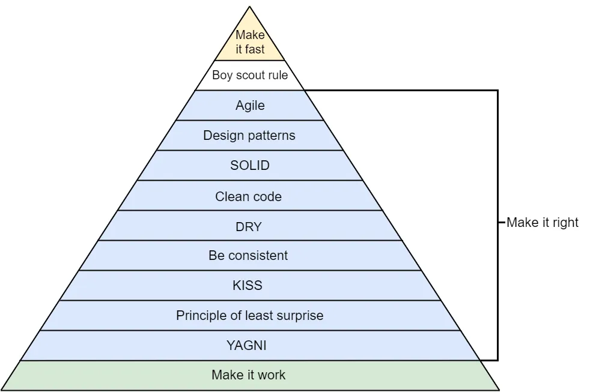

# Object-Oriented Design Principles

Design principles are fundamental guidelines that steer the development of software, ensuring that code remains robust, maintainable, and adaptable over time. In the realm of object-oriented programming (OOP) and Python, these principles are crucial for crafting effective systems. They provide a structured approach to designing software by emphasizing best practices such as modularity, code reusability, and simplicity. For instance, principles like **SOLID** focus on creating classes and objects that are easy to understand, extend, and modify, while other principles such as **DRY** (Don't Repeat Yourself) and **KISS** (Keep It Simple, Stupid) advocate for reducing redundancy and complexity in code. By adhering to these principles, developers can avoid common pitfalls like tight coupling and code bloat, ultimately resulting in systems that are more resilient to change and easier to manage. In Python, these principles are not only supported by the language’s features but also enhance the clarity and efficiency of Python code, making it easier to debug, extend, and collaborate on. Thus, understanding and applying these design principles is essential for any Python developer aiming to build high-quality software solutions.




**Resource:** https://medium.com/@bartoszkrajka/principle-of-software-development-principles-f0143d6f405


## SOLID principles

The SOLID principles are a set of design guidelines intended to improve the maintainability and flexibility of object-oriented software. These principles are designed to make systems easier to understand, more robust, and more adaptable to change. SOLID is an acronym for five principles:

1. **Single Responsibility Principle (SRP)**
2. **Open/Closed Principle (OCP)**
3. **Liskov Substitution Principle (LSP)**
4. **Interface Segregation Principle (ISP)**
5. **Dependency Inversion Principle (DIP)**


### 1. Single Responsibility Principle (SRP)

**Definition:**
A class should have only one reason to change, meaning it should have only one job or responsibility.

**Example:**
Consider a class that handles both employee details and employee persistence:

```python
class Employee:
    def __init__(self, name, id):
        self.name = name
        self.id = id

    def calculate_salary(self):
        # Logic to calculate salary
        pass

    def save_to_database(self):
        # Logic to save employee data to a database
        pass
```

This class violates SRP because it manages both employee details and data persistence. To adhere to SRP, we should refactor it into two classes:

```python
class Employee:
    def __init__(self, name, id):
        self.name = name
        self.id = id

    def calculate_salary(self):
        # Logic to calculate salary
        pass

class EmployeeDatabase:
    def save_to_database(self, employee):
        # Logic to save employee data to a database
        pass
```


### 2. Open/Closed Principle (OCP)

**Definition:**
Software entities should be open for extension but closed for modification. This means that you should be able to extend the functionality of a class without altering its existing code.

**Example:**
Consider a class that calculates the area of different shapes:

```python
class AreaCalculator:
    def calculate_area(self, shape):
        if isinstance(shape, Circle):
            return 3.14 * shape.radius ** 2
        elif isinstance(shape, Rectangle):
            return shape.width * shape.height
```

To adhere to OCP, we should use polymorphism. Define an abstract `Shape` class and extend it for specific shapes:

```python
from abc import ABC, abstractmethod

class Shape(ABC):
    @abstractmethod
    def area(self):
        pass

class Circle(Shape):
    def __init__(self, radius):
        self.radius = radius

    def area(self):
        return 3.14 * self.radius ** 2

class Rectangle(Shape):
    def __init__(self, width, height):
        self.width = width
        self.height = height

    def area(self):
        return self.width * self.height

class AreaCalculator:
    def calculate_area(self, shape: Shape):
        return shape.area()
```


### 3. Liskov Substitution Principle (LSP)

**Definition:**
Objects of a superclass should be replaceable with objects of a subclass without affecting the correctness of the program.

**Example:**
Consider a base class `Bird` and a subclass `Penguin`:

```python
class Bird:
    def fly(self):
        print("Flying")

class Penguin(Bird):
    def fly(self):
        raise Exception("Penguins can't fly")
```

The `Penguin` class violates LSP because substituting `Penguin` for `Bird` leads to an incorrect behavior. To adhere to LSP, you should design the class hierarchy in a way that each subclass adheres to the expected behavior:

```python
class Bird(ABC):
    @abstractmethod
    def move(self):
        pass

class Sparrow(Bird):
    def move(self):
        print("Flying")

class Penguin(Bird):
    def move(self):
        print("Swimming")
```


### 4. Interface Segregation Principle (ISP)

**Definition:**
Clients should not be forced to depend on interfaces they do not use. This principle advocates for creating smaller, more specific interfaces rather than one large general-purpose interface.

**Example:**
Consider a large interface that has multiple methods:

```python
class Worker(ABC):
    @abstractmethod
    def work(self):
        pass

    @abstractmethod
    def eat(self):
        pass
```

A class that implements this interface but only needs one method violates ISP:

```python
class HumanWorker(Worker):
    def work(self):
        print("Working")

    def eat(self):
        print("Eating")
```

To adhere to ISP, split the interface into smaller ones:

```python
class Workable(ABC):
    @abstractmethod
    def work(self):
        pass

class Eatable(ABC):
    @abstractmethod
    def eat(self):
        pass

class HumanWorker(Workable, Eatable):
    def work(self):
        print("Working")

    def eat(self):
        print("Eating")
```


### 5. Dependency Inversion Principle (DIP)

**Definition:**
High-level modules should not depend on low-level modules. Both should depend on abstractions. Additionally, abstractions should not depend on details; details should depend on abstractions.

**Example:**
Consider a `ReportGenerator` class that directly depends on `PDFReport`:

```python
class PDFReport:
    def generate(self):
        print("Generating PDF report")

class ReportGenerator:
    def __init__(self):
        self.report = PDFReport()

    def generate_report(self):
        self.report.generate()
```

To adhere to DIP, introduce an abstraction for reports:

```python
from abc import ABC, abstractmethod

class Report(ABC):
    @abstractmethod
    def generate(self):
        pass

class PDFReport(Report):
    def generate(self):
        print("Generating PDF report")

class ReportGenerator:
    def __init__(self, report: Report):
        self.report = report

    def generate_report(self):
        self.report.generate()
```

Now you can use `ReportGenerator` with any type of `Report` implementation, adhering to DIP.

Implementing the SOLID principles in Python helps create more maintainable, flexible, and scalable software. By following SRP, OCP, LSP, ISP, and DIP, you can design systems that are easier to understand and adapt to changing requirements, ultimately leading to more robust and efficient software solutions.

**Resources:**

https://realpython.com/solid-principles-python/

https://arjancodes.com/blog/solid-principles-in-python-programming/

https://www.youtube.com/watch?v=pTB30aXS77U


In addition to the SOLID principles, several other design principles are widely recognized in object-oriented programming (OOP). These principles provide additional guidance on creating effective, maintainable, and scalable software. Here are some of the key principles:


## DRY (Don't Repeat Yourself)

The DRY principle emphasizes that every piece of knowledge or logic should have a single, unambiguous representation in a system. In other words, avoid duplication of code or logic.

**Application:**
By adhering to the DRY principle, you reduce redundancy and make your code easier to maintain. For example, if multiple classes or functions need similar logic, encapsulate that logic in a single function or class and reuse it where needed.

**Example:**

```python
# Violating DRY
class Employee:
    def calculate_salary(self):
        return 5000

class Contractor:
    def calculate_salary(self):
        return 4000

# Adhering to DRY
class SalaryCalculator:
    def get_base_salary(self):
        return 5000

class Employee:
    def calculate_salary(self, calculator: SalaryCalculator):
        return calculator.get_base_salary()

class Contractor:
    def calculate_salary(self, calculator: SalaryCalculator):
        return calculator.get_base_salary() - 1000
```

**Resource:** https://www.geeksforgeeks.org/dont-repeat-yourselfdry-in-software-development/


## KISS (Keep It Simple, Stupid)

The KISS principle advocates for simplicity in design. The idea is to avoid unnecessary complexity and ensure that the design is as straightforward as possible.

**Application:**
Keeping your code simple makes it easier to understand, test, and maintain. Favor simple and clear solutions over complex ones, and avoid adding unnecessary features or layers.

**Example:**

```python
# Complex implementation
class ComplexCalculator:
    def calculate(self, x, y):
        if y != 0:
            return x / y
        else:
            return "Error: Division by zero"

# Simple implementation
class SimpleCalculator:
    def divide(self, x, y):
        return x / y if y != 0 else "Error: Division by zero"
```

**Resources:** https://www.geeksforgeeks.org/kiss-principle-in-software-development/


## YAGNI (You Aren't Gonna Need It)

The YAGNI principle advises against implementing functionality until it is necessary. Avoid adding features or functionality that might be needed in the future but are not required at present.

**Application:**
By following YAGNI, you reduce the risk of overengineering and ensure that your code remains focused on current requirements. This leads to simpler and more maintainable code.

**Example:**

```python
# Implementing additional features preemptively
class FeatureRichClass:
    def feature_one(self):
        pass

    def feature_two(self):
        pass

    def feature_three(self):
        pass

# Implementing only what's needed
class BasicClass:
    def feature_one(self):
        pass
```

**Resorce:** https://www.geeksforgeeks.org/what-is-yagni-principle-you-arent-gonna-need-it/


## Separation of Concerns (SoC)

The Separation of Concerns principle involves dividing a system into distinct sections, each of which addresses a separate concern or aspect of the functionality. This helps in organizing code and reducing interdependencies.

**Application:**
Apply SoC by ensuring that different parts of your application handle different responsibilities. For example, separate data access, business logic, and user interface concerns into different modules or layers.

**Example:**

```python
# Without Separation of Concerns
class UserProfile:
    def get_user_data(self):
        # Code to fetch data from the database
        pass

    def display_user_profile(self):
        # Code to display the user profile on the UI
        pass

# With Separation of Concerns
class UserDataAccess:
    def get_user_data(self):
        # Code to fetch data from the database
        pass

class UserProfile:
    def __init__(self, data_access: UserDataAccess):
        self.data_access = data_access

    def display_user_profile(self):
        # Code to display the user profile on the UI
        pass
```


## Composition Over Inheritance

The Composition Over Inheritance principle recommends using composition (i.e., including objects of other classes) instead of inheritance (i.e., extending classes) to achieve code reuse and flexibility.

**Application:**
Favor composition when you need to build complex functionality from simpler components. This approach avoids the tight coupling and rigid hierarchies that come with inheritance.

**Example:**

```python
# Using Inheritance
class Engine:
    pass

class Car(Engine):
    pass

# Using Composition
class Engine:
    pass

class Car:
    def __init__(self, engine: Engine):
        self.engine = engine
```


## Law of Demeter (LoD)

**Definition:**
The Law of Demeter, also known as the Principle of Least Knowledge, states that a class should only interact with its immediate collaborators and should not rely on the internal details of other classes.

**Application:**
To adhere to LoD, design your classes to minimize dependencies on the internal structure of other classes. This leads to more modular and maintainable code.

**Example:**

```python
# Violating LoD
class A:
    def get_b(self):
        return B()

class B:
    def get_c(self):
        return C()

class C:
    def do_something(self):
        pass

class Client:
    def perform_action(self, a: A):
        a.get_b().get_c().do_something()

# Adhering to LoD
class A:
    def perform_action(self):
        pass

class B:
    def perform_action(self):
        pass

class C:
    def perform_action(self):
        pass

class Client:
    def perform_action(self, a: A):
        a.perform_action()
```

Implementing these principles alongside SOLID helps to create software that is more modular, maintainable, and flexible. By following principles such as DRY, KISS, YAGNI, SoC, Composition Over Inheritance, and LoD, developers can enhance their design practices, leading to cleaner, more efficient, and adaptable code.
