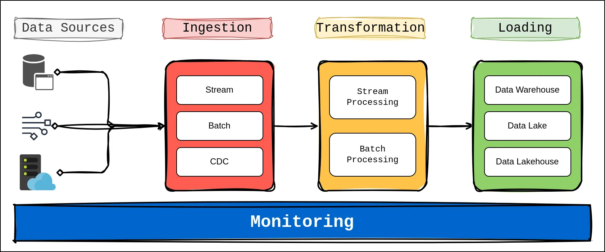

# Introduction to Data Pipelines

In the modern data-driven world, organizations are inundated with vast amounts of data generated from various sources. To harness the value of this data, it is crucial to have robust systems in place for collecting, processing, and analyzing it. This is where data pipelines come into play. 

## What is a Data Pipeline?

A data pipeline is a series of **processes** and **tools** designed to **automate** the flow of data from its source to its destination. It encompasses the entire lifecycle of data management, from initial extraction to final analysis and reporting. Data pipelines are essential for ensuring that data is collected efficiently, transformed into a usable format, and loaded into storage systems where it can be queried and analyzed.

**Purpose and Benefits**

The primary purpose of a data pipeline is to streamline and automate the data processing workflow. By setting up a data pipeline, organizations can:

- **Ensure Data Consistency:** Automate the process of data ingestion and transformation to ensure consistency across different data sources and formats.
- **Improve Efficiency:** Reduce the manual effort and time required for data processing by automating repetitive tasks.
- **Enhance Data Quality:** Implement data quality checks and transformations to clean and validate data before it reaches the final destination.
- **Enable Real-Time Analysis:** Facilitate real-time or near-real-time data processing for timely insights and decision-making.

**Real-World Examples**

1. **E-Commerce Platforms:** An e-commerce company might use a data pipeline to collect data from customer interactions, process it to analyze buying patterns, and load it into a data warehouse for further analysis and reporting.
2. **Financial Institutions:** Banks and financial institutions use data pipelines to aggregate transaction data from various sources, perform fraud detection, and generate financial reports.
3. **Social Media Analytics:** Social media platforms employ data pipelines to gather user-generated content, analyze sentiment, and deliver personalized content recommendations.

### Components of a Data Pipeline

Understanding the core components of a data pipeline is crucial for designing and managing effective data processing workflows. The main components include:

- **Data Sources:** The origin of the data, which could be databases, APIs, files, or streaming sources.
- **Ingestion:** The process of collecting and importing data from various sources into a pipeline.
- **Transformation:** The stage where data is cleaned, enriched, and transformed to fit the desired format or schema.
- **Loading:** The process of storing transformed data into databases, data warehouses, or data lakes.
- **Monitoring and Management:** Ongoing oversight to ensure the pipeline operates efficiently, handles errors, and scales as needed.

This foundational understanding will set the stage for diving deeper into each component of data pipelines and exploring how to implement and optimize them using Python and other tools.

### Python in Building Data Pipelines

Python has emerged as a powerful and versatile tool in the field of data engineering, particularly when it comes to building and managing data pipelines. Its widespread use and robust ecosystem make it a top choice for data engineers working on ETL (Extract, Transform, Load) processes and data pipeline architectures. Here's a detailed look at how Python plays a crucial role in building data pipelines:

#### 1. Versatile Data Handling

Python excels at handling various data types and formats, making it ideal for diverse data pipeline tasks. With libraries such as `pandas`, `NumPy`, and `PyArrow`, Python enables seamless manipulation of structured and unstructured data. These libraries provide functionalities for:

- **Data Extraction:** Python can connect to various data sources like databases, APIs, and flat files using libraries such as `SQLAlchemy`, `requests`, and `pandas.read_csv`.
- **Data Transformation:** Python's data processing libraries allow for efficient cleaning, merging, and aggregation of data. Functions for handling missing values, applying transformations, and performing calculations are built into these libraries.
- **Data Loading:** Python supports various methods for loading data into storage systems. For instance, `SQLAlchemy` facilitates interaction with relational databases, while `pyarrow` can be used for working with data in Parquet format.

#### 2. Automation and Scripting

Python's simplicity and readability make it an excellent choice for automating repetitive tasks within data pipelines. Through scripting, Python can automate the entire ETL process:

- **Scheduling:** Python scripts can be scheduled to run at specific intervals using tools like `cron` or Python libraries such as `schedule` and `APScheduler`.
- **Error Handling:** Python's exception handling mechanisms allow for robust error management, ensuring that data pipelines can gracefully handle unexpected issues.

#### 3. Integration with Data Processing Frameworks

Python integrates seamlessly with various data processing and orchestration frameworks, enhancing its utility in building complex data pipelines:

- **Apache Airflow:** An open-source tool for orchestrating complex workflows. Python is used to define workflows, schedule tasks, and manage dependencies in Airflow.
- **Luigi:** A Python library for building complex pipelines of batch jobs. Luigi allows for the creation of data workflows that manage dependencies and handle failures.
- **Dask:** A parallel computing library that enables scalable processing of large datasets. Dask integrates with Python's data manipulation libraries to handle big data tasks efficiently.

#### 4. Support for Big Data Technologies

Python's ecosystem includes libraries and tools that support big data processing, making it suitable for handling large-scale data pipelines:

- **PySpark:** A Python API for Apache Spark, which provides capabilities for distributed data processing and analytics.
- **Hadoop Integration:** Python can interact with Hadoop ecosystems through libraries like `hdfs` and `pydoop`, facilitating data processing and storage on Hadoop clusters.

#### 5. Data Visualization and Reporting

Once data is processed, Python can also be used for visualization and reporting:

- **Matplotlib and Seaborn:** Libraries for creating static, animated, and interactive visualizations to gain insights from processed data.
- **Plotly:** A library for creating interactive plots and dashboards, useful for presenting data analysis results.

#### 6. Community and Ecosystem

Python's large and active community contributes to a rich ecosystem of libraries, frameworks, and tools that continuously evolve. This support ensures that Python remains a relevant and powerful choice for building and managing data pipelines. The availability of open-source packages and extensive documentation further facilitates the development of efficient and reliable data pipelines.

---

**Resources:**

https://www.youtube.com/watch?v=kGT4PcTEPP8

https://www.qlik.com/us/data-integration/data-pipeline
