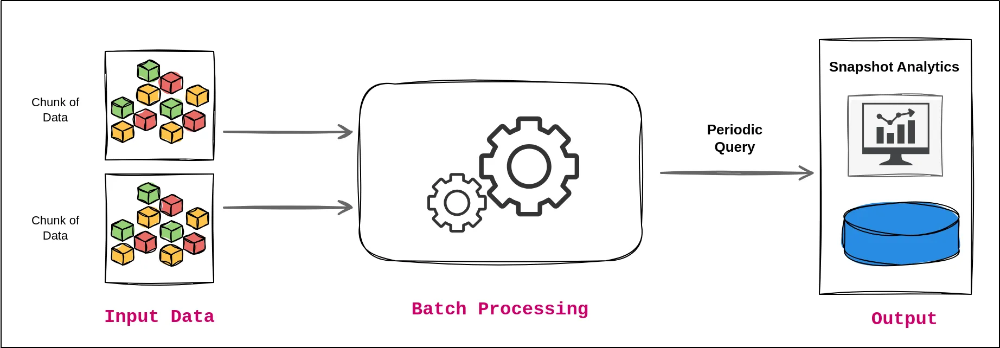
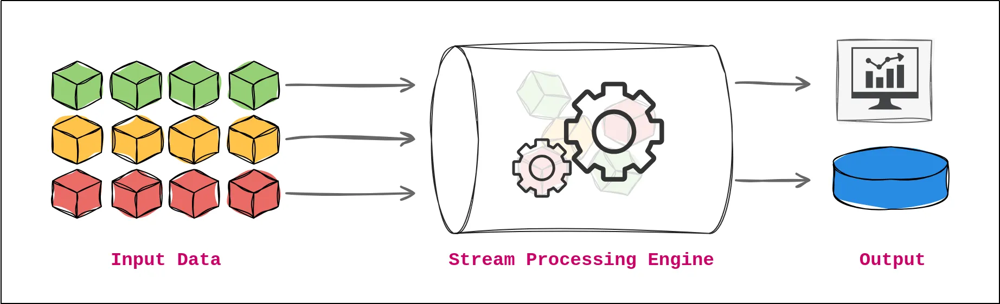
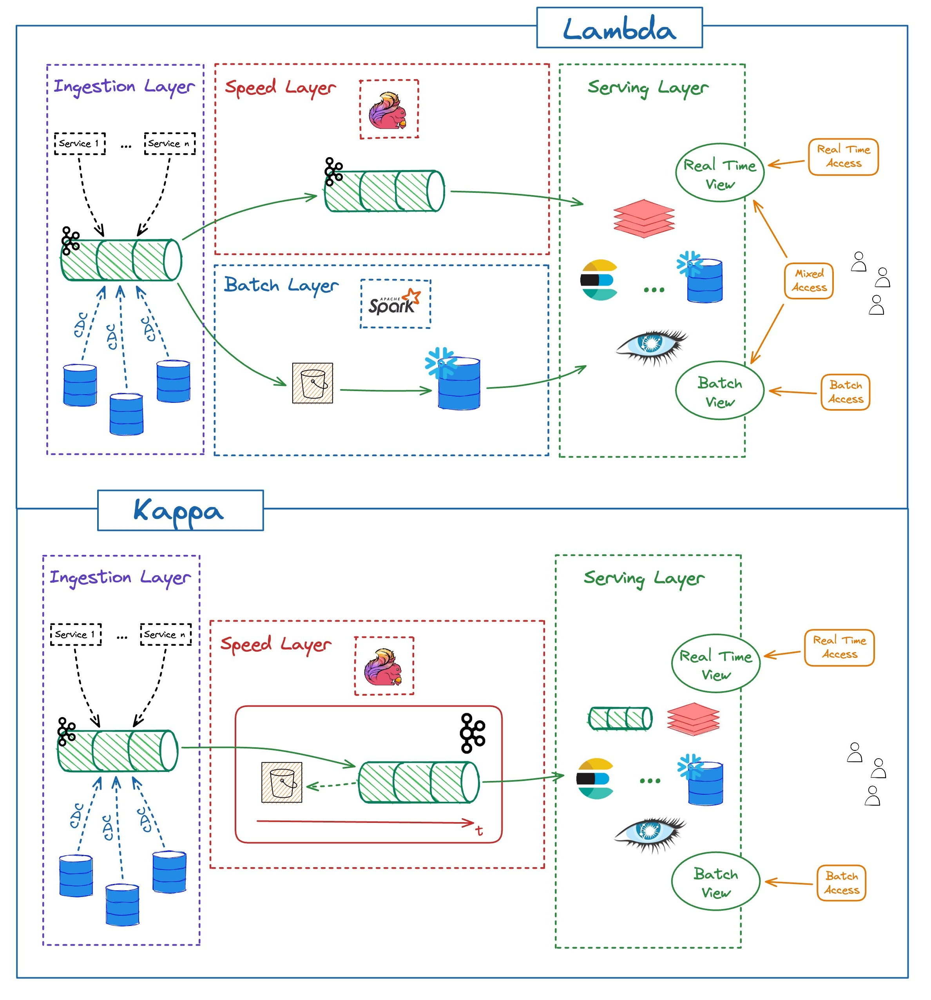

# Designing and Architecting Data Pipelines

Designing and architecting data pipelines is a critical aspect of building robust, scalable, and efficient data systems. Data pipelines are essential for managing and processing data from various sources, transforming it into meaningful insights, and delivering it to storage systems or analytical tools. This process involves a series of well-defined steps and principles that ensure data flows seamlessly through the system, meeting business needs and maintaining data integrity.

## Introduction to Data Pipeline Design

A data pipeline is a series of automated processes that extract data from diverse sources, transform it to align with business requirements, and load it into target systems for analysis or storage. The design and architecture of a data pipeline involve planning and implementing several components and processes to handle data efficiently and effectively.

**1. Importance of Design and Architecture:**

The design and architecture of data pipelines are fundamental to ensuring that data flows smoothly and meets the necessary performance, reliability, and scalability requirements. A well-designed pipeline not only facilitates efficient data processing but also supports future growth and adaptability to changing business needs. Proper design and architecture are crucial for:

- **Handling Complex Data Workflows:** Data pipelines often need to process data from various sources, perform complex transformations, and deliver it to different destinations. A solid design ensures that these workflows are well-managed and executed.
- **Optimizing Performance:** Efficient pipeline design helps in minimizing processing time, reducing latency, and maximizing resource utilization, leading to faster and more reliable data processing.
- **Ensuring Data Quality and Integrity:** Proper design and architecture ensure that data is accurately transformed and loaded, maintaining data quality and integrity throughout the pipeline.

**2. Key Aspects of Pipeline Design:**

Designing a data pipeline involves several key aspects that must be considered to achieve a successful implementation:

- **Scalability:** The pipeline should be designed to scale horizontally or vertically to accommodate growing data volumes and increased processing demands.
- **Reliability:** Ensuring that the pipeline can handle errors and failures gracefully is essential for maintaining data flow and system stability.
- **Maintainability:** The pipeline should be easy to update, troubleshoot, and manage, allowing for efficient modifications and enhancements.
- **Performance:** Optimizing the pipeline to process data quickly and efficiently is crucial for meeting business requirements and performance goals.

**3. Architecting Data Pipelines:**

The architecture of a data pipeline involves selecting and integrating various technologies and components to build a cohesive and functional system. This includes choosing appropriate data sources, transformation tools, storage systems, and monitoring solutions. Key architectural decisions include:

- **Batch vs. Streaming:** Deciding whether to implement a batch processing pipeline or a streaming pipeline based on the nature of the data and the processing requirements.
- **Technology Stack:** Selecting the right tools and technologies for data ingestion, transformation, and loading. This may involve using Python libraries, cloud services, or specialized data processing frameworks.
- **Data Pipeline Design Patterns:** Applying design patterns that address common challenges and requirements in data pipeline development, such as data partitioning, error handling, and data validation.

**4. Real-World Application:**

To understand the practical application of pipeline design and architecture, it is essential to study real-world examples and case studies. Analyzing how organizations have designed and implemented their data pipelines provides valuable insights into design decisions, trade-offs, and best practices.

In this section, we will explore the fundamental principles and best practices for designing and architecting data pipelines. We will cover key design principles, data pipeline design patterns, and practical considerations for building effective data pipelines that meet business needs and technical requirements. By understanding these concepts, we will be better equipped to create efficient, reliable, and scalable data pipelines that drive valuable insights and support data-driven decision-making.

## Design Principles

Designing data pipelines involves adhering to several key principles to ensure that the pipelines are efficient, reliable, and adaptable. The following are the core design principles that should guide the creation and maintenance of data pipelines:

### Scalability

**Definition and Importance:**
Scalability refers to the ability of a data pipeline to handle increasing volumes of data and higher workloads without sacrificing performance or reliability. A scalable pipeline can grow and adapt as data needs expand, ensuring that it continues to function effectively under higher loads.

**Key Considerations:**

- **Horizontal Scaling:** Design pipelines to scale horizontally by adding more instances or nodes to distribute the load. This can be achieved by using distributed processing frameworks or cloud-based solutions that support elastic scaling.
- **Partitioning:** Implement data partitioning strategies to divide large datasets into manageable chunks. This allows parallel processing and improves performance.
- **Load Balancing:** Use load balancers to distribute traffic evenly across multiple resources, preventing any single resource from becoming a bottleneck.

**Implementation Strategies:**

- **Modular Architecture:** Design the pipeline in a modular way, allowing individual components to scale independently. For example, separate the data ingestion, transformation, and loading components so that each can be scaled as needed.
- **Cloud Services:** Leverage cloud-based services and infrastructure that offer built-in scalability, such as Amazon Redshift, Google BigQuery, or Azure Data Factory.

### Reliability

**Definition and Importance:**
Reliability ensures that the data pipeline operates consistently and accurately, even in the face of failures or unexpected issues. A reliable pipeline minimizes downtime and maintains data integrity.

**Key Considerations:**

- **Error Handling:** Implement robust error handling mechanisms to detect, log, and address issues that arise during the pipeline’s operation. This includes retry strategies and alerting systems.
- **Redundancy:** Build redundancy into the pipeline to ensure that there are backup systems and failover mechanisms in place. This can involve having multiple instances of services or using redundant data storage.
- **Monitoring:** Set up comprehensive monitoring to track the health and performance of the pipeline. This includes logging metrics, monitoring for anomalies, and setting up alerts for potential issues.

**Implementation Strategies:**

- **Fault Tolerance:** Design components to be fault-tolerant, meaning they can continue to function or recover gracefully in case of failures.
- **Testing:** Conduct thorough testing, including unit tests, integration tests, and stress tests, to validate the pipeline's reliability under various conditions.

#### **Maintainability**

**Definition and Importance:**
Maintainability refers to how easily a data pipeline can be updated, modified, and debugged. A maintainable pipeline allows for efficient updates and quick resolution of issues.

**Key Considerations:**

- **Documentation:** Maintain comprehensive documentation for the pipeline, including architecture diagrams, data flow descriptions, and configuration details. This helps in understanding the pipeline and facilitates troubleshooting.
- **Code Quality:** Ensure high-quality code by following best practices for coding standards, modularity, and readability. Use version control systems to manage changes and collaborate effectively.
- **Configuration Management:** Implement configuration management practices to handle changes in pipeline settings or parameters. This can involve using configuration files or environment variables.

**Implementation Strategies:**

- **Automation:** Use automation tools for deployment, testing, and monitoring to reduce manual intervention and minimize errors.
- **Modular Design:** Structure the pipeline into modular components that can be updated or replaced independently without affecting the entire system.

#### **Performance Considerations**

**Definition and Importance:**
Performance considerations involve optimizing the pipeline to process data efficiently and quickly. Good performance ensures timely delivery of data and reduces the time required for data processing tasks.

**Key Considerations:**

- **Efficiency:** Optimize data processing operations to reduce resource consumption and processing time. This can involve using efficient algorithms and data structures.
- **Latency:** Minimize latency by designing the pipeline to process and deliver data as quickly as possible. This includes optimizing data transfer and processing stages.
- **Resource Utilization:** Monitor and manage resource utilization to ensure that the pipeline operates within acceptable limits and avoids resource contention.

**Implementation Strategies:**

- **Profiling and Optimization:** Regularly profile the pipeline to identify performance bottlenecks and optimize them. This can involve tuning database queries, improving data processing algorithms, and optimizing network usage.
- **Caching:** Implement caching mechanisms to store frequently accessed data or intermediate results, reducing the need for repeated processing.

## Architecting Data Pipelines

Architecting data pipelines involves designing the overall structure and flow of data through a system to ensure efficient and effective processing. This section will cover key aspects of pipeline architecture, including design patterns, choosing the right architecture for different scenarios, and utilizing Python libraries and frameworks.

### Data Pipeline Design Patterns

Data pipeline design patterns are standard solutions to common challenges in pipeline development. These patterns provide proven approaches for managing data flows, processing tasks, and ensuring reliability and scalability. Understanding these patterns helps in creating robust pipelines that address specific needs and use cases.

#### Common Design Patterns:

1. **Batch Processing:**

   Batch Processing is a data processing technique that involves collecting and processing data in large, discrete chunks or batches at scheduled intervals. This approach is ideal for scenarios where the data does not require immediate processing and can be handled in bulk, such as daily or weekly reports, large-scale data migrations, or periodic data transformations. Batch processing systems typically extract data from source systems, transform it according to business rules, and then load it into the target system, such as a data warehouse. The process can handle large volumes of data efficiently and allows for complex transformations and aggregations that might be computationally expensive if done in real-time.

   One of the primary advantages of batch processing is its ability to manage and process large datasets without placing a continuous load on system resources. By scheduling and executing processing tasks during off-peak hours, batch processing minimizes system strain and optimizes resource utilization. This method is well-suited for use cases such as financial reconciliations, log analysis, and end-of-day reporting, where timely processing is not critical but accuracy and completeness are essential. However, batch processing may introduce latency in data availability and might not be ideal for scenarios requiring real-time insights or immediate responses.

   **Advantages:** Simplifies handling large datasets and can be easier to manage and optimize. It allows for resource optimization and can handle complex transformations.

   **Use Cases:** ETL processes where data is extracted, transformed, and loaded in bulk, such as nightly data warehouse updates.

   

   

2. **Stream Processing:**

   Stream Processing is a data processing paradigm that involves continuously ingesting and analyzing data in real-time as it is generated. This approach is designed for scenarios where immediate data insights and actions are necessary, such as monitoring live system logs, real-time analytics, fraud detection, and real-time recommendation systems. Unlike batch processing, which handles data in discrete chunks, stream processing deals with data as a continuous flow, enabling immediate processing and real-time updates. Data is typically processed in small increments, allowing for low-latency operations and prompt responses to incoming data.

   The primary advantage of stream processing is its ability to deliver real-time insights and enable immediate action based on current data. By processing data as it arrives, organizations can make quick decisions, trigger alerts, and adapt to changing conditions in near real-time. This method is particularly beneficial for applications requiring up-to-the-minute accuracy, such as stock market monitoring, social media sentiment analysis, and dynamic pricing systems. However, stream processing can be more complex to implement and manage compared to batch processing, as it requires systems capable of handling high throughput and ensuring data consistency across continuous streams.

   **Advantages:** Provides real-time insights and can handle continuous data flows. It supports low-latency processing and immediate decision-making.

   **Use Cases:** Real-time analytics, monitoring systems, and event-driven architectures.

   

   

3. **Lambda Architecture:**

   Lambda Architecture is a data processing architecture designed to handle large-scale data processing by combining batch processing and real-time stream processing. The core idea of Lambda Architecture is to utilize both a batch layer and a speed layer to address the limitations of processing either batch or real-time data exclusively. The batch layer processes historical data in large batches to produce comprehensive and accurate results, while the speed layer handles real-time data to provide up-to-date insights and responses. These two layers work together to ensure that data processing is both accurate and timely, bridging the gap between the comprehensive analysis of batch processing and the immediacy of stream processing.

   The main advantage of Lambda Architecture is its ability to provide a robust and fault-tolerant system that accommodates both the need for accurate, complete data analysis and the requirement for real-time data processing. By integrating the results from both the batch and speed layers, organizations can achieve a comprehensive view of their data that includes both historical context and real-time updates. However, Lambda Architecture can be complex to implement and maintain due to its dual-layer approach, requiring careful coordination between the batch and speed layers and additional infrastructure to support both processing types. This architecture is particularly suitable for use cases that demand both accurate historical analysis and rapid, real-time insights, such as recommendation engines, fraud detection systems, and large-scale data analytics platforms.

   **Advantages:** Provides a balanced approach for handling both real-time and historical data. It enables fault-tolerant and scalable processing.

   **Use Cases:** Systems requiring both real-time and batch processing, such as hybrid data analytics platforms.

   

4. **Kappa Architecture:**

   Kappa Architecture is a streamlined data processing architecture that simplifies the complexities of managing both batch and real-time processing by using a single processing layer. Unlike Lambda Architecture, which separates data processing into distinct batch and speed layers, Kappa Architecture focuses on a unified approach where all data, whether historical or real-time, is processed in a continuous stream. In this model, data is ingested in real-time, processed immediately, and stored in a manner that allows for both real-time analytics and historical analysis. The key advantage of Kappa Architecture is its simplicity, as it eliminates the need to manage and synchronize two separate processing pipelines.

   The primary benefit of Kappa Architecture is its ability to handle real-time data processing efficiently while also providing the capability to perform historical analysis on the same dataset. This unified processing layer can reduce complexity, as there is no need to duplicate processing logic or maintain separate systems for batch and real-time processing. This architecture is particularly well-suited for scenarios where data needs to be processed and analyzed continuously, such as in real-time analytics, monitoring systems, and dynamic data applications. However, implementing Kappa Architecture requires a robust streaming platform capable of handling high-throughput data and ensuring reliable processing and storage of both current and historical data. This model is ideal for environments where simplicity and real-time processing are prioritized over the complexities of maintaining separate batch and real-time processing systems.
   
   **Advantages:** Simplifies architecture and reduces complexity by using a unified processing model. It supports real-time data processing with historical data reprocessing capabilities.
   
   **Use Cases:** Real-time data processing systems where simplicity and ease of maintenance are priorities.

| **Pattern**             | **Description**                                              | **Implementation**                                           | **Advantages**                                               |
| ----------------------- | ------------------------------------------------------------ | ------------------------------------------------------------ | ------------------------------------------------------------ |
| **Batch Processing**    | Processes data in large chunks at scheduled intervals. Suitable for handling large volumes of data. | Data is extracted, transformed in bulk, and loaded into the target storage system. Tools like Apache Airflow can be used for orchestration and scheduling. | Simplifies data management, allows for efficient handling of large datasets, and provides flexible scheduling. |
| **Stream Processing**   | Processes data in real-time as it arrives. Ideal for scenarios requiring immediate insights or actions. | Set up continuous ingestion, processing, and loading of data using tools like Apache Kafka for streaming and Apache Spark or Flink for processing. | Enables real-time analytics, immediate data processing, and timely alerts, making it suitable for applications needing up-to-date information. |
| **Lambda Architecture** | Combines batch and stream processing to handle both real-time and historical data. | Utilize a batch layer for processing historical data and a speed layer for real-time data. Results from both layers are merged for comprehensive insights. | Balances batch and real-time data handling, providing a comprehensive approach to data processing that covers both historical and immediate data needs. |
| **Kappa Architecture**  | Simplifies data processing with a single processing layer for both real-time and historical data. | Treat all data as a continuous stream, processing it in real-time using streaming platforms. Eliminate the need for a separate batch processing layer. | Reduces complexity by using a single stream-based approach for all data, focusing solely on real-time processing and simplifying architecture. |

### Choosing the Right Architecture for Different Scenarios

Selecting the appropriate architecture for a data pipeline depends on the specific requirements of the use case, such as data volume, processing frequency, and latency requirements. Choosing the right architecture ensures that the pipeline meets performance and scalability goals while addressing the unique needs of the application.

**Key Considerations:**

1. **Data Volume:**
   - **Large Data Volumes:** For large datasets, batch processing or Lambda architecture may be suitable to manage processing efficiently. Techniques such as data partitioning and distributed processing can be employed.
   - **Small to Medium Data Volumes:** Stream processing or Kappa architecture may be more appropriate for scenarios with moderate data volumes where real-time processing is desired.

2. **Processing Frequency:**
   - **Real-Time Processing:** If the application requires real-time or near-real-time processing, stream processing or Kappa architecture is recommended to ensure low latency and immediate data handling.
   - **Periodic Processing:** For scenarios where data can be processed at scheduled intervals, batch processing or Lambda architecture may be suitable for managing periodic updates and analysis.

3. **Latency Requirements:**
   - **Low Latency:** For applications with strict latency requirements, stream processing or Kappa architecture provides the capability to process data with minimal delay.
   - **Flexible Latency:** If latency is less critical and periodic updates are sufficient, batch processing or Lambda architecture can be employed to handle data processing effectively.

### Using Python Libraries and Frameworks for Pipeline Design

Python libraries and frameworks provide powerful tools for designing, implementing, and managing data pipelines. These tools help automate and streamline the development process, offering functionality for various pipeline components such as data ingestion, transformation, and scheduling.

**Popular Python Libraries and Frameworks:**

1. **Apache Airflow:**
   
   An open-source platform to programmatically author, schedule, and monitor workflows. It allows for defining complex workflows as Directed Acyclic Graphs (DAGs) and supports scheduling and monitoring.

   **Use Cases:** Complex workflows requiring scheduling, monitoring, and dependency management. Suitable for ETL processes and batch processing pipelines.
   
3. **Pandas:**
   
   A library for data manipulation and analysis. It provides data structures and functions to handle and transform data efficiently.

   **Use Cases:** Data cleaning, transformation, and analysis tasks. Ideal for processing and transforming data within the pipeline.
   
4. **PySpark:**
   
   A Python API for Apache Spark, a distributed computing framework. It supports large-scale data processing and analytics with in-memory computing.

   **Use Cases:** Distributed data processing and analytics tasks, particularly for large datasets and complex transformations.
   
5. **Dask:**
   
   A flexible parallel computing library for Python that scales from single machines to clusters. It integrates with Pandas and NumPy for parallel computing.
   
   **Use Cases:** Parallel and distributed computing for data processing tasks, suitable for handling large datasets and complex computations.
   
   

### Case Study: Designing a Data Pipeline

To illustrate the principles and concepts covered in this course, let's consider a real-world case study of designing a data pipeline for an e-commerce platform. This case study will provide a practical example of how to apply design principles and architectural patterns to build an effective data pipeline.

#### Overview

Our e-commerce platform processes a large volume of transactions daily. The platform needs a robust data pipeline to handle data from various sources, including sales transactions, customer interactions, and inventory updates. The goal is to create a data pipeline that efficiently ingests, transforms, and loads this data into a data warehouse for analytics and reporting.

#### Pipeline Requirements

- **Scalability:** The pipeline must handle increasing data volumes as the platform grows.
- **Reliability:** It should operate consistently and handle errors gracefully.
- **Maintainability:** The pipeline should be easy to update and manage.
- **Performance:** It must provide timely processing and insights.

|                                           | **Details**                                                  |
| ----------------------------------------- | ------------------------------------------------------------ |
| Case Study Overview                       | This case study involves designing a data pipeline for an e-commerce platform. The pipeline needs to handle data from sales transactions, customer interactions, and inventory updates. Key goals are scalability, reliability, maintainability, and performance. |
| Data Sources and Ingestion                | **Data Sources:** Sales transactions, customer interactions, inventory updates.   **Ingestion Approach:**   - Batch Processing for sales and inventory data   - Stream Processing for real-time customer interactions |
| Data Transformation                       | **Transformation Objectives:**   - Data Cleaning: Remove duplicates, correct errors, standardize formats   - Data Enrichment: Combine data from multiple sources   - Data Aggregation: Generate summary metrics and reports   **Transformation Approach:**   - Batch Transformation: Python scripts with Pandas   - Real-Time Transformation: Apache Spark or Dask |
| Data Loading                              | **Loading Targets:** MySQL data warehouse   **Loading Approach:**   - Batch Loading: Schedule periodic updates   - Real-Time Loading: Use Kafka topics for real-time data and periodic loading |
| Architectural Patterns and Design Choices | **1. Batch Processing Pattern:**   - **Implementation:** Extract, transform, load data in batch   - **Advantages:** Simplified management, efficient handling of large volumes   **2. Stream Processing Pattern:**   - **Implementation:** Real-time processing for customer interactions   - **Advantages:** Immediate data processing, real-time analytics |
| Design Decisions and Trade-Offs           | **1. Scalability vs. Complexity:**   - Scalability with batch or stream processing   - Complexity of real-time processing vs. simplicity of batch   **2. Real-Time vs. Batch Processing:**   - Real-Time: Immediate insights, complex setup   - Batch: Easier management, latency in data availability   **3. Data Consistency vs. Performance:**   - Data consistency vs. performance optimization   **4. Tooling and Frameworks:**   - Apache Airflow: Workflow orchestration   - Apache Kafka: Real-time data streaming   - Pandas and PySpark: Data transformation and analysis |

## Differences Between ETL and ELT

### ETL (Extract, Transform, Load)

ETL involves extracting data from source systems, transforming it into a suitable format or structure, and then loading it into a target system, such as a data warehouse. Typically used when transformations need to be applied before loading the data into the target system. It is often used in scenarios with structured data where transformation requirements are complex and need to be done before loading. Traditional ETL tools include Informatica, Talend, and Microsoft SSIS.

- **Advantages**: Ensures that data is cleaned and transformed before loading into the target system, which can be beneficial for data integrity and compliance. It’s suitable for structured data and provides comprehensive data processing.

### ELT (Extract, Load, Transform)

ELT involves extracting data from source systems, loading it directly into the target system, and then performing transformations within the target system. Typically used in scenarios with large volumes of raw data or where the target system (like a modern data warehouse) is capable of handling extensive data processing. It's often used with cloud-based data warehouses that have powerful processing capabilities. Common ELT tools include Google BigQuery, Amazon Redshift, and Snowflake.

- **Advantages**: Leverages the processing power of modern data warehouses for transformations, which can be more efficient for big data scenarios. It simplifies the architecture by reducing the number of moving parts and is well-suited for handling large-scale, raw data.

### ETL/ELT and Data Pipeline Design Patterns

1. **Batch Processing and ETL**
   
   Batch Processing is often used in conjunction with **ETL**. In a batch processing pipeline, data is collected, processed, and transformed in large chunks at regular intervals. ETL in this context involves extracting data in batches, applying transformations to the entire batch, and then loading it into the target system.
   
   - **Use Case**: Suitable for scheduled, large-scale data processing where real-time updates are not required.
   
2. **Stream Processing and ELT**
   
   Stream Processing is often associated with **ELT** when handling real-time data. In a stream processing pipeline, data is processed as it arrives, with minimal delay. ELT can be used here to load data into a staging area or data warehouse and then perform transformations in real-time or near real-time.
   
   - **Use Case**: Ideal for real-time analytics and data processing where immediate insights and actions are required.
   
3. **Lambda Architecture and Batch/Stream Processing**
   
   Lambda Architecture combines both **Batch Processing** and **Stream Processing**. It uses a batch layer for processing historical data and a speed layer for processing real-time data. ETL is typically used in the batch layer, while **Stream Processing** is used in the speed layer. The results from both layers are merged to provide a comprehensive view of the data.
   
   - **Use Case**: Provides a balance between processing historical and real-time data, suitable for scenarios where both types of data need to be analyzed.
   
4. **Kappa Architecture and Stream Processing**
   
   Kappa Architecture simplifies data processing by using a single processing layer for both real-time and historical data, focusing on **Stream Processing**. ELT can be employed here to directly load data into the processing system, where it is continuously transformed and analyzed.
   
   - **Use Case**: Suitable for scenarios where data is processed as a continuous stream, eliminating the need for separate batch processing layers.

### Summary
- **ETL** is commonly used in batch processing pipelines, where data is transformed before loading.
- **ELT** is often used in stream processing pipelines, where data is loaded first and transformed within the target system.
- **Lambda Architecture** combines batch and stream processing, leveraging ETL for batch processing and stream processing for real-time data.
- **Kappa Architecture** focuses solely on stream processing, simplifying the architecture by handling all data as a continuous stream and employing ELT for efficient processing.

## Resources

https://www.geeksforgeeks.org/what-is-lambda-architecture-system-design/

https://hazelcast.com/glossary/kappa-architecture/

https://www.dremio.com/wiki/kappa-architecture/

https://www.upsolver.com/blog/batch-stream-a-cheat-sheet

https://www.striim.com/blog/what-is-a-data-pipeline-and-must-have-features-of-modern-data-pipelines/

https://pradeepl.com/blog/lambda-architecture/

https://x.com/Aurimas_Gr/status/1653692318921138179
