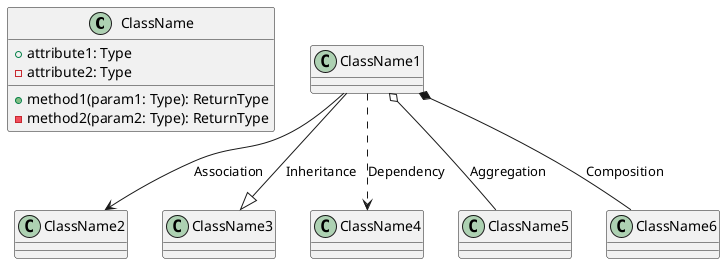
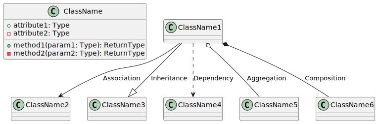
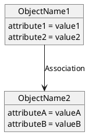
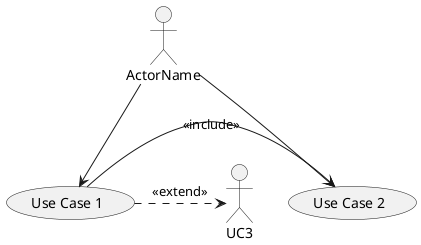
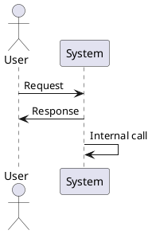
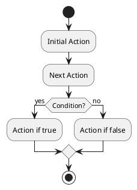
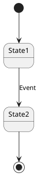
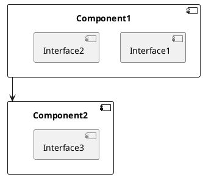
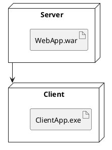

# PlantUML

PlantUML is a versatile and powerful tool that allows users to create a wide variety of UML diagrams through simple and intuitive textual descriptions. By using a straightforward syntax, PlantUML enables developers, designers, and project managers to easily document and visualize the structure and behavior of their systems without the need for complex and expensive graphical tools. This text-based approach makes it possible to integrate UML diagram creation seamlessly into documentation, code comments, and version control systems, ensuring that diagrams remain up-to-date with the latest changes in the system.

The conversion of PlantUML syntax into an image is straightforward and can be accomplished using various methods and tools. Once the textual description of the diagram is written in the PlantUML syntax, it can be processed by the PlantUML engine to generate a graphical representation. This conversion can be done locally on a user's machine or through online services. Tools such as the PlantUML command line, desktop applications like PlantUML QEditor, and IDE plugins for IntelliJ IDEA, Eclipse, and Visual Studio Code provide seamless ways to convert text to images. Additionally, there are web-based tools like PlantText and PlantUML Online Server that allow users to input their PlantUML code and instantly see the corresponding diagrams.

For those looking to integrate PlantUML into their development workflow, there are several useful tools and extensions available. IDE plugins for popular development environments such as Visual Studio Code, IntelliJ IDEA, and Eclipse enhance productivity by providing real-time diagram previews and syntax highlighting. Command-line tools like the PlantUML jar file can be incorporated into build scripts for automated documentation generation. Web-based tools offer the convenience of generating diagrams without installing any software. Furthermore, platforms like GitLab and GitHub support PlantUML, enabling users to embed and render UML diagrams directly in their repositories' README files or wikis, fostering better collaboration and communication among team members.
You can use https://www.planttext.com/ to generate diagram from plantuml syntax.

## Class Diagram

**Syntax:**

**Explanation:**

- Define a class using the `class` keyword.
- Use `+` for public, `-` for private, and `#` for protected attributes and methods.
- Relationships: Association (`-->`), Inheritance (`--|>`), Dependency (`..>`), Aggregation (`o--`), Composition (`*--`).

## Object Diagram

**Syntax:**

**Explanation:**

- Define objects using the `object` keyword.
- List attributes and their values within the object block.
- Relationships: Association (`-->`).

## Use Case Diagram

**Syntax:**

**Explanation:**

- Define actors using the `actor` keyword.
- Define use cases using the `usecase` keyword.
- Relationships: Association (`-->`), Include (`-right->` with `<<include>>`), Extend (`.>` with `<<extend>>`).

## Sequence Diagram

**Syntax:**

**Explanation:**

- Define actors and participants.
- Use `->` for synchronous messages, `-->` for asynchronous messages.
- Use `:` to label messages.

## Activity Diagram

**Syntax:**

**Explanation:**

- Use `start` and `stop` for start and end points.
- Use `:` to define actions.
- Use `if` and `endif` for decision points.

## State Diagram

**Syntax:**

**Explanation:**

- Use `[*]` for initial and final states.
- Define states and transitions using `-->`.

## Component Diagram

**Syntax:**

**Explanation:**

- Use `component` to define components.
- Use `[]` to define interfaces.
- Use `-->` to define relationships.

## Deployment Diagram

**Syntax:**

**Explanation:**

- Use `node` to define nodes.
- Use `artifact` to define artifacts.
- Use `-->` to define relationships.

### Conclusion

PlantUML provides a flexible and easy-to-use syntax to create various UML diagrams. By defining actors, classes, use cases, objects, states, activities, components, and nodes using simple textual descriptions, you can effectively model the structure and behavior of your system.
